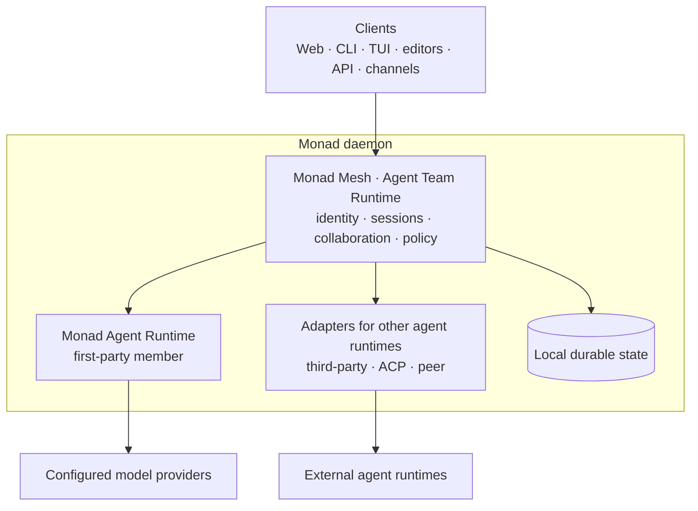

<p align="center">
  <picture>
    <source media="(prefers-color-scheme: dark)" srcset="docs/assets/monad-logo-dark.svg">
    
  </picture>
</p>

<p align="center"><strong>Monad is an open-source agent team runtime from Monadix — daemon-first, with headless architecture.</strong></p>

<p align="center">
  <a href="https://github.com/Monadix-AI/monad/actions/workflows/ci.yml"></a>
  <a href="LICENSE"></a>
  
</p>

<p align="center">
  <a href="#roadmap">Roadmap</a> ·
  <a href="#install-monad">Install</a> ·
  <a href="#the-runtime-behind-the-team">Runtime</a> ·
  <a href="#agent-runtimes-in-the-mesh">Agent runtimes</a> ·
  <a href="#common-questions">FAQ</a> ·
  <a href="https://docs.monadix.ai/guides/alternatives">Comparison</a> ·
  <a href="https://docs.monadix.ai">Documentation</a> ·
  <a href="README.zh-CN.md">简体中文</a>
</p>

**Models can reason. Agents can act. A team needs somewhere to live.**

Today an agent's identity, memory, permissions, and history belong to whatever product happens to run it. Close that product and the work is gone; change vendors and the team starts over. Tools that sit on top can coordinate those processes, but they cannot own what the processes own.

**Monad is where agents live.** One long-lived local daemon holds the identity, capabilities, permissions, memory, sessions, collaboration state, approvals, and audit history itself — and keeps them when clients close, when the daemon restarts, and when you swap the runtime underneath a teammate. Web, command-line interface (CLI), terminal user interface (TUI), editor, application programming interface (API), and messaging clients all drive that one shared state; none of them becomes authoritative.

**Monad Mesh** is the agent team runtime built on that ownership. A member can be backed by any agent runtime: third-party agent providers such as Codex and Claude Code, Agent Client Protocol (ACP) agents, peer daemons you own, or **Monad Agent Runtime**, the first-party runtime Monad bundles so you can start with one agent.

It is a runtime, not a platform to deploy: a single binary, one process on the machine you already work on — no cluster, message server, gateway, or object store. Under Monad Agent Runtime, autonomy grows under real containment: tool calls gated by approvals, child processes confined by the OS sandbox, network egress filtered, and every decision recorded. A member backed by a third-party runtime keeps that runtime's own execution and permission model; Monad records its activity and proxies its approval prompts where the provider exposes them.

Monad stores its state on your machine and binds to local interfaces by default. Requests to your configured model providers still leave the machine. Read the [runtime security model](docs/internals/infra/runtime.md#security-model) before enabling remote access.

## At a glance

| | |
|---|---|
| License | MIT, published by Monadix Labs, Inc. |
| Install footprint | One binary, one process — no cluster, message server, gateway, or object store |
| Operating systems | macOS, Linux, and Windows, with continuous integration on all three |
| Clients | Web UI, CLI, TUI, editor bridges, HTTP API, and messaging channels |
| Agent runtimes a member can use | Monad Agent Runtime, third-party agent providers, ACP agents, and peer daemons you own |
| Model providers | 24 built-in types: 8 with dedicated SDKs, 16 OpenAI-compatible presets |
| Messaging channels | 17 adapters, including Telegram, Discord, Slack, WhatsApp, Signal, and email |
| Containment | Approval gate, OS sandbox, filtered egress, and audit under Monad Agent Runtime |
| Telemetry | None: no analytics, crash reports, or usage pings |

## Roadmap

| Area | Stage | What to expect |
|---|---|---|
| **Monad Mesh** | Alpha | Core functionality is stable and usable: team ownership, session bindings, policy, observation, and collaboration state. |
| **Monad Agent Runtime** | Experimental | Core functionality works, but the Web experience and detail features are still being completed, and the API can change between releases. |

## Install Monad

Install Monad on macOS or Linux:

```bash
curl -fsSL https://release.monadix.ai/monad/install.sh | bash
monad
```

Install Monad from PowerShell 5.1 or later on Windows:

```powershell
irm https://release.monadix.ai/monad/install.ps1 | iex
monad
```

The installer verifies the release, adds `monad` to your `PATH`, starts the daemon, and opens the Web UI.

### Manual installation

Download the archive for your platform and its matching `.sha256` file from [GitHub Releases](https://github.com/Monadix-AI/monad/releases). Verify the checksum, extract the archive, and run `bin/monad`.

For Apple Silicon macOS, replace `release_version_here` with the release tag:

```bash
release_version=release_version_here
asset="monad-${release_version}-darwin-arm64"
release_url="https://github.com/Monadix-AI/monad/releases/download/v${release_version}"

curl -fSLO "${release_url}/${asset}.tar.gz"
curl -fSLO "${release_url}/${asset}.tar.gz.sha256"
shasum -a 256 -c "${asset}.tar.gz.sha256"
tar -xzf "${asset}.tar.gz"
"./${asset}/bin/monad" --help
```

Release archives are self-contained. Bun and Node.js are not required at runtime. Linux releases include glibc and musl variants.

See [installation and removal](docs/usage/installation.md) for exact checksum commands, supported targets, upgrades, and uninstall steps.

## The runtime behind the team

The daemon answers the operational questions that a model or chat window cannot:

- **Continuity**: work survives client closure, reconnects, and daemon restarts
- **Identity and policy**: every team member gets explicit capabilities, credentials, and approval rules, with sandbox boundaries applied to execution the daemon runs itself
- **Shared work**: sessions, tasks, artifacts, and collaboration state use one durable source of truth
- **Human oversight**: high-risk actions stop at an approval boundary before execution
- **Multiple clients**: every interface controls the same runtime state
- **Tailored Web experiences**: Workplace Experiences reshape the browser workflow without creating another runtime

This is what daemon-first and headless mean in Monad: clients and agent runtimes can be replaced, but they do not own the team or its work.

## Agent runtimes in the mesh

Monad Mesh owns the team. Each member is backed by an agent runtime that executes its turns:

| Agent runtime | Role |
|---|---|
| **Monad Agent Runtime** | Monad's first-party runtime and the default member: model and tool loop with context, memory, approvals, and sandboxed execution |
| **Third-party agent providers** | Codex, Claude Code, Gemini CLI, Qwen Code, and other provider-native runtimes operated as teammates |
| **ACP agents** | Editor-side or spawned agents reached over the Agent Client Protocol |
| **Peer daemons** | Another Monad daemon owned by the same operator |

Every option uses daemon-owned team identity, session bindings, policy, observation, and collaboration state. The first-party runtime is optional: a mesh can consist entirely of the others, and adding one does not create another product or data silo.

## How Monad is structured



Workplace Experiences live inside the Web client. They present daemon-owned state for coding, research, operations, or content workflows, but they do not define cross-client capabilities.

See the [developer architecture](docs/internals/index.md) for request lifecycle, startup, storage, extension, and containment details.

## Capabilities

| Capability | What it gives you |
|---|---|
| [Mesh agents](docs/usage/mesh-agents.md) | Provider-native agent runtimes operated as observable team members |
| [ACP](docs/internals/agent-team-runtime/acp.md) | Editor integration and delegation to other ACP runtimes |
| [Peer federation](docs/internals/agent-team-runtime/peer-federation.md) | Delegation to another Monad daemon owned by the same operator |
| [Sessions](docs/usage/sessions.md) | Durable work that streams across clients and can branch or resume |
| [Models](docs/usage/model-providers.md) | Hosted and local model providers for the first-party runtime |
| [Skills](docs/usage/skills.md) | Portable `SKILL.md` instructions loaded when an agent needs them |
| [Model Context Protocol](docs/usage/mcp.md) | External tools connected through standard servers |
| [Atom packs](docs/internals/infra/atoms.md) | Installable providers, channels, commands, adapters, hooks, and experiences |
| [Channels](docs/usage/channels.md) | Messaging access through Telegram, Discord, Slack, and other adapters |
| [Sandboxing](docs/usage/sandbox-backends.md) | Process isolation and controlled network egress across supported platforms |

## Documentation

The full documentation site is **[docs.monadix.ai](https://docs.monadix.ai)**. The pages
below are the same content in this repository.

Documentation has two audiences:

| Audience | Start here |
|---|---|
| **Users and operators** | [Get started](docs/getting-started.md), then use the [task guides](docs/usage/) |
| **Developers and contributors** | Read the [developer documentation](docs/index.md#developer-facing-documentation) and [contribution guide](CONTRIBUTING.md) |

Use [product concepts](docs/concepts.md) for shared vocabulary and [troubleshooting](docs/usage/troubleshooting.md) when the runtime does not behave as expected.

## Common questions

**What is Monad?** An open-source agent team runtime from Monadix. One long-lived local
daemon owns the identity, capabilities, permissions, memory, sessions, collaboration state,
approvals, and audit history of your agents, and keeps them when clients close, when the
daemon restarts, and when you swap the runtime backing a member.

**How is it different from an agent framework such as LangGraph or CrewAI?** A framework is
a library inside your process that expresses agent logic. Monad is a process that outlives
your script: it owns credentials, gates tool calls behind human approval, confines child
processes in an OS sandbox, and keeps an audit trail. Framework-built agents can join a
Monad team over the Agent Client Protocol.

**Can Claude Code, Codex, or Gemini CLI join a Monad team?** Yes. A member can be backed by
a third-party agent provider, an ACP agent, a peer daemon you own, or Monad Agent Runtime.
A member backed by a third-party runtime keeps that runtime's own execution and permission
model; Monad records its activity and proxies approval prompts where the provider exposes
them.

**Does Monad send my code or data to the cloud?** Monad sends no telemetry, analytics, crash
reports, or usage pings, and stores its state on your machine. Requests to the model
providers you configure still leave the machine, because that is where inference happens.

**Do I need Kubernetes, a message broker, or a database server?** No. Monad is a runtime,
not a platform you deploy: one binary and one process on your own machine.

**Is it production-ready?** Monad Mesh is in alpha and Monad Agent Runtime is experimental —
see [Roadmap](#roadmap) for what that means per area.

More answers are in the [FAQ](https://docs.monadix.ai/guides/faq), and the tool-by-tool
comparison is in [how Monad compares](https://docs.monadix.ai/guides/alternatives).

## Community and security

- [Contributing guide](CONTRIBUTING.md)
- [Roadmap](ROADMAP.md)
- [Governance](GOVERNANCE.md)
- [Security policy and vulnerability reporting](SECURITY.md)
- [Code of Conduct](CODE_OF_CONDUCT.md)
- [Issue tracker](https://github.com/Monadix-AI/monad/issues)

## License

[MIT](LICENSE) © Monadix Labs, Inc.

Bundled third-party components retain their own licenses. See [`packages/sandbox-vm/vendor/THIRD_PARTY_LICENSES.md`](packages/sandbox-vm/vendor/THIRD_PARTY_LICENSES.md) and run `monad license list` for the generated dependency inventory.
