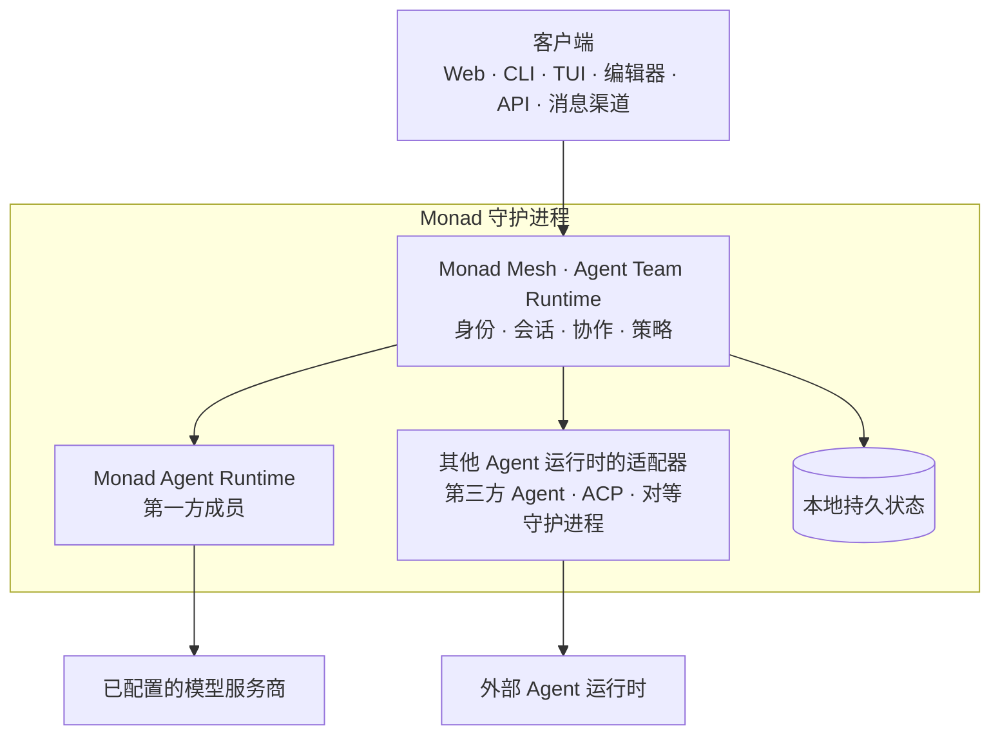

<p align="center">
  <picture>
    <source media="(prefers-color-scheme: dark)" srcset="docs/assets/monad-logo-dark.svg">
    
  </picture>
</p>

<p align="center"><strong>Monad 是 Monadix 推出的开源 Agent 团队运行时，采用无头架构、以守护进程为核心。</strong></p>

<p align="center">
  <a href="https://github.com/Monadix-AI/monad/actions/workflows/ci.yml"></a>
  <a href="LICENSE"></a>
  
</p>

<p align="center">
  <a href="#路线图">路线图</a> ·
  <a href="#快速开始">快速开始</a> ·
  <a href="#agent-团队背后的运行时">团队运行时</a> ·
  <a href="#mesh-中的-agent-运行时">Agent 运行时</a> ·
  <a href="#常见问题">常见问题</a> ·
  <a href="https://docs.monadix.ai">文档</a> ·
  <a href="README.md">English</a>
</p>

**模型能够推理，Agent 能够行动，而一支团队需要一个安身之处。**

今天，Agent 的身份、记忆、权限和历史都属于恰好在运行它的那个产品：产品一关，工作就没了；换一家厂商，团队就得重来。叠在上面的工具可以调度这些进程，却无法拥有进程所拥有的东西。

**Monad 就是 Agent 生活的地方。** 一个长期运行的本地守护进程自己持有身份、能力、权限、记忆、会话、协作状态、审批与审计记录，并在客户端关闭、守护进程重启、乃至更换某个成员底层运行时之后依然保留。Web、命令行、终端、编辑器、应用程序接口（API）和消息渠道操作的都是这同一份状态，谁都不会成为权威状态源。

**Monad Mesh** 就建立在这份所有权之上，是 Agent 团队运行时。成员可以由任意 Agent 运行时承载：Codex、Claude Code 等第三方 Agent 服务商运行时、Agent Client Protocol（ACP）Agent、你自己拥有的对等守护进程，或 **Monad Agent Runtime**——Monad 随附的第一方运行时，让你可以从一个 Agent 开始。

它是运行时，不是需要部署的平台：一个二进制、一个进程，就跑在你日常使用的机器上，不需要集群、消息服务器、网关或对象存储。在 Monad Agent Runtime 上，自治程度可以在真实的约束下逐步放大——工具调用经过审批门、子进程由操作系统沙箱隔离、网络出口经过过滤，每一次决定都被记录。由第三方运行时承载的成员，沿用该运行时自己的执行与权限模型；Monad 记录它的活动，并在服务商暴露审批的前提下代理它的审批提示。

Monad 默认把自身状态保存在你的设备上，并且只监听本机接口。发送给已配置模型服务商的请求仍会离开设备。启用远程访问前，请阅读[运行时安全模型](docs/internals/infra/runtime.md#security-model)。

## 一览

| | |
|---|---|
| 许可证 | MIT，由 Monadix Labs, Inc. 发布 |
| 安装体积 | 一个二进制、一个进程——不需要集群、消息服务器、网关或对象存储 |
| 操作系统 | macOS、Linux、Windows，三个平台都跑持续集成 |
| 客户端 | Web 界面、CLI、TUI、编辑器桥接、HTTP API、消息渠道 |
| 成员可用的 Agent 运行时 | Monad Agent Runtime、第三方 Agent 提供方、ACP Agent、你自己拥有的对等 daemon |
| 模型提供方 | 24 种内置类型：8 种专用 SDK，16 种 OpenAI 兼容预设 |
| 消息渠道 | 17 个适配器，包括 Telegram、Discord、Slack、WhatsApp、Signal、邮件 |
| 约束 | 在 Monad Agent Runtime 下提供审批门、操作系统沙箱、出站过滤与审计 |
| 遥测 | 无：不发送分析、崩溃报告或使用统计 |

## 路线图

| 部分 | 阶段 | 当前状态 |
|---|---|---|
| **Monad Mesh** | Alpha | 核心功能已经稳定、可以使用：团队所有权、会话绑定、策略、观测与协作状态。 |
| **Monad Agent Runtime** | Experimental | 核心功能可用，但 Web 体验和细节功能仍在完善，API 在版本之间可能变更。 |

## 快速开始

在 macOS 或 Linux 上安装 Monad：

```bash
curl -fsSL https://release.monadix.ai/monad/install.sh | sh
```

如果没有 `curl`，可改用 `wget`：

```bash
wget -qO- https://release.monadix.ai/monad/install.sh | sh
```

在 Windows PowerShell 5.1 或更高版本中安装 Monad：

```powershell
irm https://github.com/Monadix-AI/monad/releases/latest/download/install.ps1 | iex
```

dist 安装器会安装 `monad`、`monad-update` 并把安装目录加入 `PATH`，然后在交互式终端中自动启动
守护进程和打开 Web UI。自动化或静默安装只安装二进制文件；准备启动时运行 `monad up`。

### 手动安装

从 [GitHub Releases](https://github.com/Monadix-AI/monad/releases) 下载适合当前平台的发行包及对应 `.sha256` 文件。校验 checksum、解压发行包，再运行 `monad`。

Apple Silicon macOS 示例，请把 `release_version_here` 替换为发行版本号：

```bash
release_tag=v0.1.3
asset="monad-aarch64-apple-darwin"
release_url="https://github.com/Monadix-AI/monad/releases/download/${release_tag}"

curl -fSLO "${release_url}/${asset}.tar.gz"
curl -fSLO "${release_url}/${asset}.tar.gz.sha256"
shasum -a 256 -c "${asset}.tar.gz.sha256"
tar -xzf "${asset}.tar.gz"
"./${asset}/monad" --help
```

没有 `curl` 时，可用以下命令下载同样的两个文件：

```bash
wget -q "${release_url}/${asset}.tar.gz"
wget -q "${release_url}/${asset}.tar.gz.sha256"
```

发行包是自包含的，运行时不需要 Bun 或 Node.js。Linux 同时提供 glibc 与 musl 版本。

具体校验命令、支持平台、升级和卸载步骤见[安装与卸载](docs/usage/installation.md)。

## Agent 团队背后的运行时

守护进程解决模型或聊天窗口本身无法处理的运行问题：

- **连续性**：关闭客户端、重新连接或重启守护进程后，工作仍然存在
- **身份与策略**：每个团队成员都有明确的能力、凭据和审批规则；沙箱边界作用于守护进程自己执行的部分
- **共享工作**：会话、任务、产物与协作状态使用同一份持久事实来源
- **人类监督**：高风险动作在执行前停在审批边界
- **多个客户端**：每种界面都控制同一份运行时状态
- **定制 Web 体验**：Workplace Experience 可以重组浏览器工作流，但不会创建另一套运行时

这就是 Monad 所说的 daemon-first 与 headless：客户端和 Agent 运行时可以替换，但它们不拥有团队或团队的工作。

## Mesh 中的 Agent 运行时

Monad Mesh 拥有团队；每个成员由一个 Agent 运行时执行其轮次：

| Agent 运行时 | 作用 |
|---|---|
| **Monad Agent Runtime** | Monad 的第一方运行时，也是默认成员：模型与工具循环，包含上下文、记忆、审批和沙箱执行 |
| **第三方 Agent 服务商** | 把 Codex、Claude Code、Gemini CLI、Qwen Code 等服务商原生运行时作为队友运行 |
| **ACP Agent** | 通过 Agent Client Protocol 接入的编辑器侧或独立 Agent |
| **对等守护进程** | 同一操作者拥有的另一个 Monad 守护进程 |

所有方式都使用守护进程持有的团队身份、会话绑定、策略、观察与协作状态。第一方运行时是可选的：mesh 可以完全由其他运行时组成，加入它们也不会创建另一套产品或数据孤岛。

## Monad 的结构



Workplace Experience 位于 Web 客户端内部。它可以针对编码、研究、运维或内容工作呈现守护进程状态，但不能定义仅在 Web 中存在的关键能力。

请求生命周期、启动、存储、扩展与约束细节见[开发者架构](docs/zh-Hans/internals/index.md)。

## 核心能力

| 能力 | 你可以做什么 |
|---|---|
| [Mesh agents](docs/usage/mesh-agents.md) | 把服务商原生 Agent 运行时作为可观察的团队成员运行 |
| [ACP](docs/internals/agent-team-runtime/acp.md) | 接入编辑器，并向其他 ACP 运行时委派工作 |
| [Peer federation](docs/internals/agent-team-runtime/peer-federation.md) | 向同一管理员拥有的另一台 Monad 守护进程委派工作 |
| [会话](docs/usage/sessions.md) | 跨客户端持续工作，并创建分支或恢复会话 |
| [模型](docs/usage/model-providers.md) | 为第一方运行时连接云端或本地模型，并按配置与角色路由 |
| [Skills](docs/usage/skills.md) | 在 Agent 需要时加载可移植的 `SKILL.md` 指令 |
| [Model Context Protocol](docs/usage/mcp.md) | 通过标准服务连接外部工具 |
| [Atom packs](docs/internals/infra/atoms.md) | 安装模型服务商、渠道、命令、适配器、Hooks 与 Experience |
| [消息渠道](docs/usage/channels.md) | 通过 Telegram、Discord、Slack 等渠道访问团队 |
| [沙箱](docs/usage/sandbox-backends.md) | 在支持的平台隔离进程并控制网络出口 |

## 文档

完整文档站：**[docs.monadix.ai](https://docs.monadix.ai)**。下列页面是仓库内的同一份内容。

文档分为两类：

| 读者 | 从这里开始 |
|---|---|
| **用户与运行时管理员** | 阅读[快速上手](docs/zh-Hans/getting-started.md)，再按任务查阅[使用指南](docs/usage/) |
| **开发者与贡献者** | 阅读[开发者文档](docs/zh-Hans/index.md#面向开发者的文档)和[贡献指南](CONTRIBUTING.md) |

共享术语见[产品概念](docs/concepts.md)。运行时行为异常时，查阅[故障排查](docs/usage/troubleshooting.md)。

## 常见问题

**Monad 是什么？** Monadix 推出的开源 Agent 团队运行时。一个长期运行的本地守护进程持有 Agent 的身份、能力、权限、记忆、会话、协作状态、审批和审计历史，并在客户端关闭、守护进程重启、成员底层运行时更换之后继续保有这些状态。

**它和 LangGraph、CrewAI 这类 Agent 框架有什么区别？** 框架是运行在你进程内的库，用来表达 Agent 逻辑。Monad 是比你的脚本活得更久的进程：它持有凭据、把工具调用挡在人工审批之后、用操作系统级沙箱约束子进程，并保留审计记录。框架构建的 Agent 可以通过 Agent Client Protocol 加入 Monad 团队。

**Claude Code、Codex、Gemini CLI 能加入 Monad 团队吗？** 可以。成员可以由第三方 Agent 服务商、ACP Agent、你自己拥有的对等守护进程，或 Monad Agent Runtime 承载。由第三方运行时承载的成员沿用该运行时自己的执行与权限模型；Monad 记录它的活动，并在服务商暴露审批的前提下代理审批提示。

**Monad 会把我的代码或数据传到云端吗？** Monad 不发送任何遥测、分析、崩溃报告或使用统计，状态存放在你自己的设备上。发往你所配置的模型服务商的请求仍会离开设备，因为推理发生在那里。

**需要 Kubernetes、消息队列或数据库服务器吗？** 不需要。Monad 是运行时，不是需要部署的平台：你自己设备上的一个二进制、一个进程。

**可以用于生产环境了吗？** Monad Mesh 处于 alpha，Monad Agent Runtime 仍是实验阶段 —— 各部分的具体含义见[路线图](#路线图)。

更多解答见[常见问题](https://docs.monadix.ai/zh-Hans/guides/faq)，逐项对比见[与其他 Agent 工具的对比](https://docs.monadix.ai/zh-Hans/guides/alternatives)。

## 社区与安全

- [贡献指南](CONTRIBUTING.md)
- [Roadmap](ROADMAP.md)
- [治理方式](GOVERNANCE.md)
- [安全策略与漏洞报告](SECURITY.md)
- [行为准则](CODE_OF_CONDUCT.md)
- [问题追踪](https://github.com/Monadix-AI/monad/issues)

## 许可证

[MIT](LICENSE) © Monadix Labs, Inc.

打包的第三方组件保留各自许可证。请参阅 [`packages/sandbox-vm/vendor/THIRD_PARTY_LICENSES.md`](packages/sandbox-vm/vendor/THIRD_PARTY_LICENSES.md)，或运行 `monad license list` 查看依赖清单。
