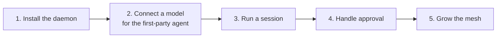
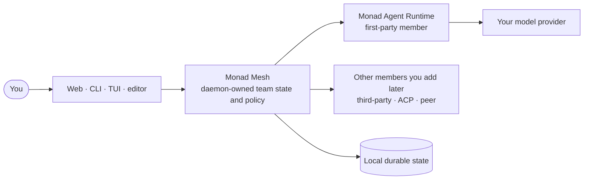
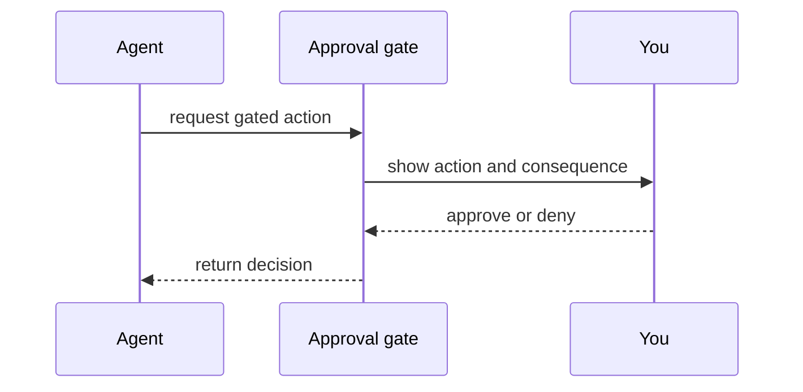

import { LocalRuntimeData } from '/snippets/local-runtime-data.mdx';

This tutorial takes you from installation to a working mesh in five steps. What you are building is a **Monad Mesh**: a durable agent team the daemon owns. It starts with one member — **Monad Agent Runtime**, Monad's bundled first-party agent — and grows by adding other agent runtimes without moving any work.

Monad stores its own state on your machine. Requests to the model provider you choose still leave the machine.

<LocalRuntimeData />

简体中文版：[开始使用 Monad](/zh-Hans/getting-started)



## 1. Install Monad

Use one of the installation methods in the
[root README](https://github.com/Monadix-AI/monad/blob/main/README.md#install-monad). In an interactive
terminal, the installer starts the daemon and opens the Web UI on macOS, Linux, and Windows, including
the setup flow for a new installation. After an automated or quiet install, run `monad up` to do the same.



The mesh owns the team and its work. Closing a browser or terminal does not transfer that authority to another client.

## 2. Connect a model

Your first mesh member is Monad Agent Runtime, and it needs a model provider. Monad does not bundle local inference. If you plan to work only through third-party agent providers such as Codex or Claude Code, they authenticate separately — skip to step 5.

Choose one setup route:

| Route | Command or location |
|---|---|
| Guided terminal setup | Run `monad init` |
| Scripted setup | Run `monad provider set` and `monad credential add` |
| Guided web setup | Run `monad` on a new installation |
| Web settings | Open **Studio → Models and providers** |

The setup flow tests the connection before saving it and lets you choose a default model. See [model providers](/usage/model-providers) for provider-specific configuration.

Check the result:

```bash
monad model list
monad status
monad doctor
```

## 3. Run your first session

A session is one durable work thread. It survives client closure and daemon restart, and you can operate it from any client.

Run a one-off task:

```bash
monad chat "summarize what changed in this folder"
```

Create and observe a named session:

```bash
monad session new "my first session"
monad session send session_id_here "hello"
monad session watch session_id_here
monad session list
```

The same session appears in the Web UI because state lives in the daemon. See [sessions](/usage/sessions) and the [CLI reference](/usage/cli) for branching, restoration, and scripting.

## 4. Handle an approval

When an agent requests a gated action, the turn stops and waits for a decision. The approval shows the requested action and its consequence.



Keep these rules in mind:

- **Denial is a normal result**: the agent receives it and can continue
- **The gate fails closed**: a high-risk call is denied when no client can answer
- **Sandboxing is separate**: approval does not replace process and network containment

See [sandbox backends](/usage/sandbox-backends) before increasing agent autonomy.

## 5. Grow the mesh

Add members first, then capability. Existing sessions and history stay where they are.

| Goal | Add | Guide |
|---|---|---|
| Run a provider-native runtime as a teammate | A third-party agent (Codex, Claude Code, Gemini CLI, …) | [Third-party agents](/usage/mesh-agents) |
| Hand a bounded subtask to another agent | An Agent Client Protocol connection | [ACP](/internals/agent-team-runtime/acp) |
| Use another machine you own | A peer daemon | [Peer federation](/internals/agent-team-runtime/peer-federation) |
| Coordinate several members on one body of work | A project and its members | [Build a team](/guides/from-one-agent-to-team) |
| Decide which member does what | — | [Choose a runtime](/guides/choosing-runtime) |

Then extend what a member can do:

| Goal | Add | Guide |
|---|---|---|
| Add reusable operating knowledge | A skill | [Skills](/usage/skills) |
| Connect external tools | A Model Context Protocol server | [MCP](/usage/mcp) |
| Reach the team from a messaging app | A channel | [Channels](/usage/channels) |
| Install a vendor capability bundle | An Atom Pack | [Atoms](/internals/infra/atoms) |

Type `/` in the chat input to inspect available skills and commands.

## Continue from here

- [What Monad is](/product) explains the product boundary
- [Product concepts](/concepts) define the shared vocabulary
- [Usage guides](/usage/index) cover operational tasks
- [Privacy](/usage/privacy) explains local data and network egress
- [Troubleshooting](/usage/troubleshooting) maps symptoms to checks and fixes
