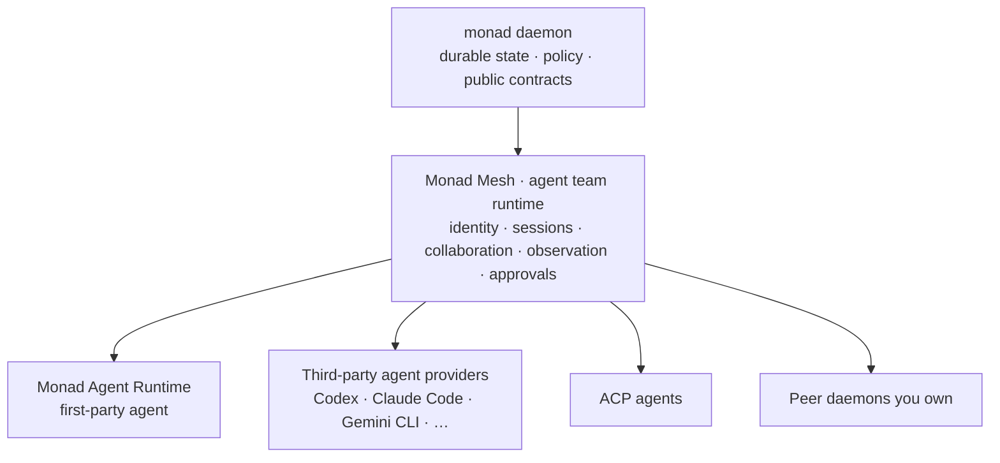

An agent's identity, memory, permissions, and history normally belong to whatever product runs it. Close the product and the work is gone; change vendors and the team starts over.

**Monad is where agents live.** Monad is an open-source agent team runtime from Monadix: a daemon-first runtime with headless architecture, released under the MIT license and installed as one binary. One long-lived local daemon holds the team's identity, capabilities, permissions, memory, sessions, collaboration state, approvals, and audit history, and keeps them across client closures, restarts, and a change of runtime under any member. Clients render and control that state; none of them owns it.

**Monad Mesh** is the agent team runtime built on that ownership. It gives every agent a durable identity, binds agents to sessions and projects, and coordinates delegation, observation, approvals, and recovery. Agents from many runtimes can join one mesh: third-party agent providers such as Codex and Claude Code, Agent Client Protocol (ACP) agents, peer daemons you own, and **Monad Agent Runtime**, Monad's bundled first-party agent runtime and default member.

It installs as one binary and runs as one process on the machine you already use. It needs no cluster, message server, gateway, or object store. Under Monad Agent Runtime, every agent action runs with approvals, OS-level sandboxing, filtered egress, and audit. A member backed by a third-party runtime keeps that runtime's execution and permission model. Monad records its activity and proxies approval prompts when the provider exposes them. [Why Monad](/guides/comparison) explains the product boundary.

## Monad at a glance

| | |
|---|---|
| License | MIT, published by Monadix Labs, Inc. |
| Install footprint | One binary, one process — no cluster, message server, gateway, or object store |
| Operating systems | macOS, Linux, and Windows, with continuous integration on all three |
| Local transports | HTTP over TCP loopback and over a Unix domain socket |
| Clients | Web UI, CLI, TUI, editor bridges, HTTP API, and messaging channels |
| Agent runtimes a member can use | 4 kinds: Monad Agent Runtime, third-party agent providers, ACP agents, and peer daemons you own |
| [Model providers](/usage/model-providers) | 24 built-in provider types: 8 with dedicated SDKs, 16 OpenAI-compatible presets, plus custom providers as Atom Packs |
| [Messaging channels](/usage/channels) | 17 channel adapters across long-polling, WebSocket, webhook, IMAP, and subprocess ingress |
| [Containment](/usage/sandbox-backends) | Approval gate, OS sandbox (Seatbelt, Landlock and seccomp or bwrap, AppContainer), filtered egress, and audit |
| [Telemetry](/usage/privacy) | None: no analytics, crash reports, or usage pings |

This documentation separates operating the product from building and changing it.

| Audience | Start here | Goal |
|---|---|---|
| **Users and operators** | [Get started](/getting-started) | Install Monad, build a mesh, attach agent runtimes, and configure policy |
| **Developers and contributors** | [Developer-facing documentation](#developer-facing-documentation) | Build against public contracts, extend Monad, or change the repository |

Simplified Chinese entry points: [文档首页](/zh-Hans), [快速上手](/zh-Hans/getting-started), [架构总览](/zh-Hans/internals/index), and [项目首页](https://github.com/Monadix-AI/monad/blob/main/README.zh-CN.md).

## User-facing documentation

User-facing pages explain what Monad does and help you complete an operational task. They do not require knowledge of daemon internals.

| Document | Use it to |
|---|---|
| [What Monad is](/product) | Understand the daemon-first product boundary and its execution model |
| [Product concepts](/concepts) | Understand Monad Mesh, agent runtimes, sessions, tasks, artifacts, approvals, and clients |
| [Getting started](/getting-started) | Install Monad, connect a model, run a session, and handle approvals |
| [Installation and removal](/usage/installation) | Check requirements, install manually, upgrade, or uninstall |
| [Usage guides](/usage/index) | Find one task-oriented guide per user-facing capability |
| [Comparison](/guides/alternatives) | See how Monad differs from agent frameworks, provider-native agents, and agent platforms |
| [FAQ](/guides/faq) | Get short answers about scope, security, supported systems, and what leaves your machine |

### Build the team: Monad Mesh

Monad Mesh is the agent team runtime and the first thing to learn. It decides who is on the team, what each member may do, and how their work is bound to sessions, observed, and approved.

| Document | Use it to |
|---|---|
| [Build a team](/guides/from-one-agent-to-team) | Grow from one supervised agent to a durable multi-agent project |
| [Choose a runtime](/guides/choosing-runtime) | Pick which agent runtime executes a given piece of work |
| [Third-party agents](/usage/mesh-agents) | Run provider-native agent runtimes as observable teammates |
| [Native CLI approvals](/usage/native-cli-approvals) | Configure approval behavior for native CLI agents |

### Run the first-party agent: Monad Agent Runtime

Monad Agent Runtime is Monad's own agent runtime and the default mesh member. It is an attached capability, not the product boundary. A mesh can run without it.

| Document | Use it to |
|---|---|
| [Model providers](/usage/model-providers) | Connect the models it calls |
| [Skills](/usage/skills) | Use, author, gate, and manage `SKILL.md` capabilities |
| [Model Context Protocol](/usage/mcp) | Connect external tool servers and configure trust controls |
| [Computer use](/usage/computer-use) | Add browser and desktop control through MCP servers |

### Operate the daemon

These guides cover the durable daemon and the clients that control it:

| Document | Use it to |
|---|---|
| [Sessions](/usage/sessions) | Create, branch, restore, and observe sessions across clients |
| [CLI](/usage/cli) | Run commands, scripts, and structured output workflows |
| [Daemon API](/usage/api) | Use transports, authentication, realtime streams, errors, and OpenAPI |
| [Web UI](/usage/web) | Navigate the browser client and Studio |
| [TUI](/usage/tui) | Start the terminal client and drive a session from it |
| [Channels](/usage/channels) | Connect and configure messaging platforms |
| [Releases](/usage/releases) | Select a release channel, upgrade, or roll back |
| [Troubleshooting](/usage/troubleshooting) | Diagnose daemon, provider, channel, MCP, and sandbox failures |

### Tune trust

| Document | Use it to |
|---|---|
| [Sandbox backends](/usage/sandbox-backends) | Choose containment for agent actions |
| [Agent runtime credentials](/usage/agent-runtime-credentials) | Grant write-only credentials to generated processes |
| [Privacy](/usage/privacy) | Understand local storage and network egress |

## Developer-facing documentation

Developer-facing pages explain public contracts, shipped architecture, extension points, engineering choices, and product design foundations.

| Section | Read it when |
|---|---|
| [Internals](/internals/index) | Building on daemon APIs, protocols, execution adapters, or runtime behavior |
| [Engineering](/engineering/index) | Understanding repository architecture, engineering philosophy, or technology choices |
| [Design](/design/index) | Understanding product principles or the shared visual system |

### Runtime internals

The internals follow the daemon-first product boundary:

| Category | What it covers |
|---|---|
| [Monad Mesh](/internals/agent-team-runtime/index) | The agent team runtime: team identity, project sessions, collaboration, delegation, observation, and federation |
| [Monad Agent Runtime](/internals/agent-runtime/index) | The first-party agent runtime: tool loop, context, memory, and operation provenance |
| [Infrastructure](/internals/infra/index) | Daemon lifecycle, transports, configuration, storage, extensions, and model routing |
| [Developer reference](/internals/reference) | Shared terminology for services, extension kinds, collaboration mechanisms, and clients |

Build against public protocol and client packages. Do not import daemon implementation details. Prefer documented extension surfaces such as skills, atom packs, Model Context Protocol servers, hooks, agent adapters, and Workplace Experiences.

### Understand the repository

These public pages explain stable design decisions without prescribing the repository workflow:

| Document | What it covers |
|---|---|
| [Architecture](/engineering/architecture) | Package boundaries and dependency direction |
| [Engineering philosophy](/engineering/philosophy) | Verification, explicit contracts, and ownership principles |
| [Technology stack](/engineering/tech-stack) | Runtime, libraries, build tools, and quality systems |
| [Product principles](/design/product-principles) | Product boundaries, audiences, evidence, brand, and accessibility |
| [Design system](/design/design-system) | Visual tokens, surfaces, typography, spacing, and motion |

Repository rules and development practices are intentionally not published through Mintlify. Start with [CONTRIBUTING.md](https://github.com/Monadix-AI/monad/blob/main/CONTRIBUTING.md), then use the [repository-only development documentation](https://github.com/Monadix-AI/monad/tree/main/docs/internal/development). Coding-agent coordination lives separately in the [repository-only agent documentation](https://github.com/Monadix-AI/monad/tree/main/docs/internal/agents).

Package-specific documentation stays next to its implementation. Examples include the [Web app docs](https://github.com/Monadix-AI/monad/tree/main/apps/web/docs), [sandbox hardening status](https://github.com/Monadix-AI/monad/blob/main/packages/sandbox/docs/hardening.md), and [RTK client documentation](https://github.com/Monadix-AI/monad/blob/main/packages/client-rtk/README.md).

Agent instructions are not product documentation. Edit `.rulesync/rules/`, then run `bun run agents:sync`. Do not edit generated `AGENTS.md` or `CLAUDE.md` files.
