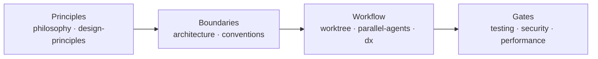

This directory contains the repository rules and development practices shared by human contributors and coding agents. Mintlify excludes it from the public documentation site. Setup and pull request mechanics live in [CONTRIBUTING.md](../../../CONTRIBUTING.md).

## Read in this order

| Order | Doc | Covers |
|---|---|---|
| 1 | [Engineering philosophy](../../engineering/philosophy.md) | Make correct code the path of least resistance |
| 2 | [Application design principles](design-principles.md) | Cross-platform parity and security-first agent containment |
| 3 | [Repository architecture](../../engineering/architecture.md) | Package boundaries, dependency direction, and extension points |
| 4 | [Code conventions](conventions.md) | Comments, file length, abstraction, typing, and contracts |
| 5 | [Worktree development](worktree.md) | Worktree-per-feature workflow, quality gates, merge, and cleanup |
| 6 | [Testing](testing.md) | Layout, isolation, mock models, transport loops, and assertion rules |

## When the change touches…

| Area | Read |
|---|---|
| A network boundary, credential, filesystem path, or tool dispatch | [Security guidelines](security-guidelines.md) |
| A hot path such as streaming, SQLite, transcript rendering, or bundle size | [Performance guidelines](performance-guidelines.md) |
| The CLI surface | [CLI design conventions](cli-design.md) |
| UI or copy | [Internal design rules](design/) |
| Several agents working in parallel | [Parallel agent development](../agents/parallel-agents.md) |
| A slow edit-to-verify loop | [Developer experience](dx.md) |
| An unfamiliar tool or library in the repository | [Technology stack](../../engineering/tech-stack.md) |

## Reference

| Doc | Covers |
|---|---|
| [Agent credential development migration](agent-credentials-dev-migration.md) | Migrating a development home to the current credential model |

## Docs that live with their package

Package-scoped detail is kept next to the code it describes; this directory keeps only the
repo-wide rules that point at it.

| Doc | Covers |
|---|---|
| [`packages/sandbox/docs/hardening.md`](../../../packages/sandbox/docs/hardening.md) | Per-platform confinement status and known gaps behind [security guidelines § 8](security-guidelines.md#8-process-execution-sandbox) |
| [`packages/atoms/docs/model-provider-test-status.md`](https://github.com/Monadix-AI/monad/blob/main/packages/atoms/docs/model-provider-test-status.md) | Manual end-to-end coverage status per provider type |
| [`apps/web/docs/`](https://github.com/Monadix-AI/monad/tree/main/apps/web/docs) | Web router and the app's UI checklist |
