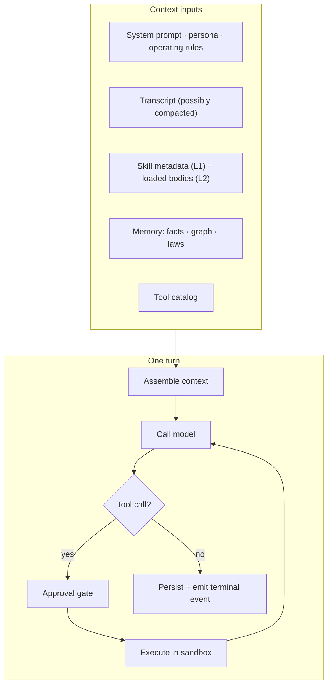
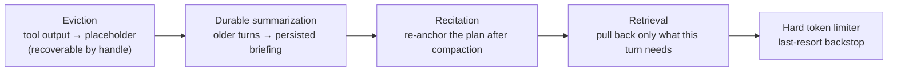
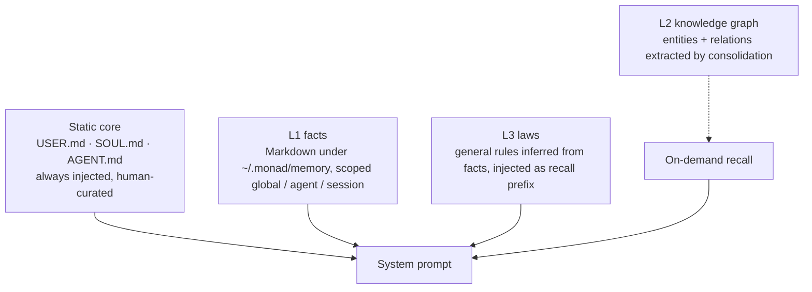
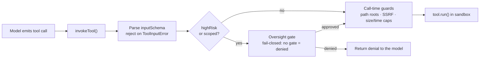

This category covers Monad Agent Runtime: the agent runtime Monad ships itself, and the default member of a mesh. It explains what enters a turn, how the agent calls tools, and what it remembers. [Monad Mesh](/internals/agent-team-runtime/index) owns the session, team membership, policy, and durable collaboration state around that turn.

This runtime is one member among several and is optional. Third-party agent providers, Agent Client Protocol agents, and peer daemons join the same mesh through adapters and do not execute through it.

## Context pressure is a cascade, not a cliff

Cheap and lossless first; lossy only when it must be. Every stage is observable or
recoverable. The runtime never truncates this state silently.

Details and the `context.*` config block: [context-management.md](/internals/agent-runtime/context-management).

## Memory is layered by cost and durability

`/consolidate` runs the dedup/merge/extract pipeline; `/why` traces a belief back to the
messages that produced it. Details: [memory.md](/internals/agent-runtime/memory).

## Every tool call passes one seam

Never call `tool.run()` directly. The gate and sandbox context are applied by
`invokeTool` only. Details: [tools.md](/internals/agent-runtime/tools).

## Documents

| Doc | Covers |
|---|---|
| [tools.md](/internals/agent-runtime/tools) | Registry layout, uniform module contract, authoring and security rules |
| [context-management.md](/internals/agent-runtime/context-management) | The gentle cascade, eviction handles, summarization, observability |
| [memory.md](/internals/agent-runtime/memory) | L1/L2/L3 layers, consolidation pipeline, provenance, contradiction checks |
| [operation-source.md](/internals/agent-runtime/operation-source) | Immutable provenance, server stamping, and the temporary transport-authority exception |

Related pages cover the [user-facing session model](/usage/sessions) and [skill authoring](/usage/skills). Repository contributors must also follow the [security rules](https://github.com/Monadix-AI/monad/blob/main/docs/internal/development/security-guidelines.md) for Agent tool code.
