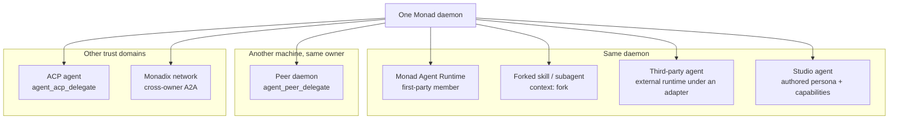
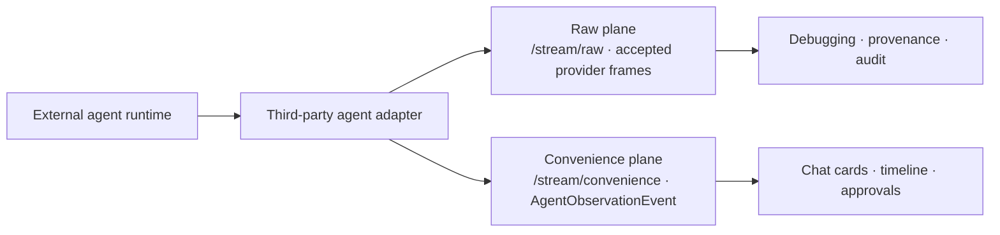
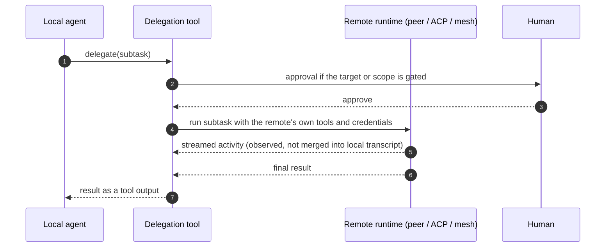

Monad Mesh is Monad's Agent Team Runtime and the product's primary runtime. It owns team identity, session bindings, collaboration, delegation, observation, approvals, and recovery across every agent runtime and client.

Members can be backed by any agent runtime. [Monad Agent Runtime](/internals/agent-runtime/index) is the first-party one Monad ships; the rest attach through adapters. This category covers everything that crosses an agent boundary: another first-party agent, a provider-native runtime, an editor, or another machine you own.

Pick by trust boundary, not by convenience:

| Mechanism | Runs where | Credentials used | Use when |
|---|---|---|---|
| Monad Agent Runtime | This daemon | Yours | The default member: Monad-native tools, memory, and approvals |
| Forked skill / subagent | This daemon | Yours | Isolating a long procedure from the main transcript |
| Third-party agent | This daemon, external CLI/runtime process | Yours | Driving Codex, Claude Code, and similar runtimes as teammates |
| ACP delegation | Editor-side or spawned agent | Theirs | Handing a subtask to another ACP agent |
| Peer federation | Another daemon **you own** | The peer's | The work needs that machine's files or credentials |
| Monadix | Someone else's runtime | Theirs | Cross-owner collaboration with independent trust and billing |

## Observation has two planes

A teammate agent is not a black box: Monad keeps both the provider's own frames and a
provider-neutral projection of them.

Raw frames never enter the chat message log and never enter model context; the
convenience plane is what the UI renders. Details:
[mesh-observation.md](/internals/agent-team-runtime/mesh-observation), authoring:
[mesh-adapter-authoring.md](/internals/agent-team-runtime/mesh-adapter-authoring).

## Delegation, end to end

The local agent gets a **result**, not the remote's raw reasoning stream. That stream stays in
the observation planes where a human can inspect it.

## Documents

| Doc | Covers |
|---|---|
| [mesh-observation.md](/internals/agent-team-runtime/mesh-observation) | Session scoping, connection snapshots, raw vs convenience streams, cursors |
| [mesh-adapter-authoring.md](/internals/agent-team-runtime/mesh-adapter-authoring) | Writing an adapter for a third-party agent runtime |
| [project-sessions.md](/internals/agent-team-runtime/project-sessions) | Project ownership, Project Member identity, and per-session bindings |
| [acp.md](/internals/agent-team-runtime/acp) | Monad as an editor agent, and delegating to other ACP agents |
| [peer-federation.md](/internals/agent-team-runtime/peer-federation) | Same-owner daemon-to-daemon delegation over an OpenAI-compatible endpoint |
| [workplace-experiences.md](/internals/agent-team-runtime/workplace-experiences) | Web-UI-only experience registry, host API, and the known management-isolation gap |

Related: [`../../usage/mesh-agents.md`](/usage/mesh-agents) for operating mesh
agents, [`../../concepts.md`](/concepts) for the product-level vocabulary.
