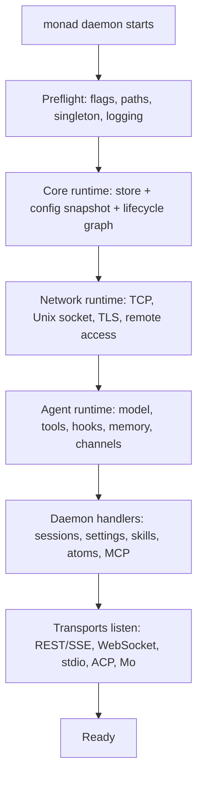

# Daemon architecture

monad is a local, single-user agent runtime. The daemon is the only long-lived
process that owns state, credentials, model routing, tool execution, extension
loading, and network transports. Client surfaces such as the CLI, web UI, TUI,
ACP bridge, and channels are thin entry points into that daemon.

This document explains the architecture from two angles:

- **Users and operators**: what starts, what hot-reloads, and what remains local.
- **Third-party developers**: where to extend monad and which boundaries not to cross.

**Scope: inside the process** — the startup graph, lifecycle modules, hot
reload, and extension boundaries. The daemon's outside surface — how it binds,
physical transports, configuration/env vars, and the security model — is
[runtime.md](runtime.md)'s territory. For agent-reachable tool rules, see
[tools.md](tools.md).

## User-facing model

At startup the daemon does five things:

1. Runs preflight: resolves flags, paths, singleton/process mode, logging, and
   `MONAD_HOME`.
2. Builds the core runtime: opens the store, loads `config.json` / `profile.json`
   / `auth.json`, then starts lifecycle modules in dependency order.
3. Builds network state: resolves loopback host, port, TLS, local fallback, and
   remote-access policy.
4. Builds agent-facing services: model router, approval gate, hooks, commands,
   memory, scheduling, channels, and daemon handlers.
5. Launches transports: HTTP REST/SSE over TCP and Unix socket, WebSocket push,
   stdio mode, ACP mode, Mo, channels, and background monitors (binding and
   fallback semantics: [runtime.md](runtime.md)).

The user-visible result is simple: the daemon becomes reachable, clients can send
sessions, and edits to configuration or installed extensions apply without a
restart where the owning module supports reload.



Hot reload is intentionally conservative. It exists to improve local UX, not to
process a high-volume event stream:

- filesystem watchers only invalidate the current snapshot;
- `ConfigService` waits for a trailing quiet period before applying;
- only one apply is in flight at a time;
- if another change arrives while apply is running, the daemon marks itself dirty
  and applies the final latest snapshot after the active apply settles;
- accepted state changes only after the owning module commits successfully.

This protects the app from config-write storms and keeps the final user edit from
being overwritten by an older in-flight reload.

## Startup and reload internals

The entrypoint is intentionally thin:

```text
apps/monad/src/main.ts
  -> application/lifecycle.ts:startDaemon()
    -> application/core-runtime.ts:createCoreRuntime()
      -> runtime/create.ts:createDaemonRuntime()
        -> RuntimeKernel
        -> ConfigService
    -> application/network-runtime.ts
    -> application/agent-runtime.ts
    -> application/transport-runtime.ts
```

`RuntimeKernel` owns lifecycle ordering. Each runtime module declares:

- `id`
- `requires` / `after`
- `criticality`
- `start(ctx, signal)`
- optional `reload(current, snapshot, ctx, signal)`
- optional `stop(current, ctx)`

The kernel builds topological layers, starts independent modules in a layer
concurrently, commits module outputs into `RuntimeContext`, records serializable
lifecycle state in a vanilla Zustand store, reloads modules layer-by-layer, and
stops committed modules in reverse dependency order.

Current core modules are assembled in `runtime/create.ts`:

| Module | Owner | Responsibility |
|---|---|---|
| `store` | `store/lifecycle.ts` | SQLite/KV data layer and cleanup |
| `platform.sandbox` | `platform/sandbox/lifecycle.ts` | sandbox roots and host setup |
| `agent.model` | `agent/model/lifecycle.ts` | model service, provider discovery, catalog, embedding indexer |
| `capabilities` | `capabilities/lifecycle.ts` | stable first-party tool and command registries |
| `atoms` | `atoms/lifecycle.ts` | built-in and third-party atom discovery |
| `capabilities.skills` | `capabilities/skills/lifecycle.ts` | personal/workspace skill discovery and watch integration |
| `capabilities.mcp` | `capabilities/mcp/lifecycle.ts` | configured and atom-contributed MCP connections |

`ConfigService` is a sibling of `RuntimeKernel`, not a child. It owns config/auth
I/O, watching, invalidation, and accepted snapshots. It delegates schema and file
layout to `@monad/home`, then calls `RuntimeKernel.reload(snapshot)` and any
application-level reload targets.

## Developer extension points

Most third-party work should use one of these public extension surfaces instead
of importing daemon internals:

| Goal | Extension surface | Notes |
|---|---|---|
| Add procedural knowledge | Skill directory with `SKILL.md` | Portable, lazy-loaded, hot-reloaded |
| Add MCP tools | `mcp` atom or configured MCP server | Runs through the daemon MCP client and approval/tool gates |
| Add a model provider | Provider atom / provider config | Discovered by the model service |
| Add an IM/channel adapter | Channel atom | Normalizes inbound messages into daemon sessions |
| Add hooks | Command hooks or atom hooks | Runs at typed agent-loop events |
| Add built-in daemon behavior | Owning daemon domain module | Core contributors only; keep lifecycle adapter beside the owning domain |

Atom and skill authors should not import `apps/monad` internals. The stable
contracts live in `@monad/sdk-atom`, `@monad/protocol`, and the documented config
files under `@monad/home`.

## Ownership rules for core contributors

- Keep lifecycle adapters beside the behavior they own. Do not create a second
  hierarchy under `runtime/modules`.
- Keep `runtime/create.ts` as the composition root for core lifecycle modules.
  It imports descriptors; it should not contain business logic.
- Keep `application/lifecycle.ts` as orchestration glue for preflight, core,
  network, agent-facing services, handlers, and transport launch.
- Do not rebuild the agent loop at daemon startup. Model/provider services start
  at startup; per-session agent execution is assembled when a session turn runs.
- Keep runtime objects out of Zustand. Zustand stores serializable lifecycle
  state only; service instances live in `RuntimeContext`.
- Do not introduce RxJS, revision queues, or a global event log for local config
  reload. Use the existing trailing-debounce, single-flight `ConfigService`.
- Settings writes go through `ConfigService.updateConfig()` or
  `ConfigService.updateAuth()` so persistence and hot-apply stay coupled.
- New reloadable subsystems should expose a stable facade and mutate/reconnect
  internal handles on reload where possible.

## Text sequence

```text
1. main.ts imports startDaemon() and exits.
2. startDaemon() runs preflight and returns early for supervisor-only modes.
3. createCoreRuntime() opens the data layer and loads the initial config/auth snapshot.
4. createDaemonRuntime() creates RuntimeKernel + ConfigService.
5. RuntimeKernel starts lifecycle layers:
   store
   platform.sandbox
   agent.model
   capabilities
   atoms
   capabilities.skills / capabilities.mcp
6. createNetworkRuntime() resolves listener configuration from the accepted config.
7. createAgentRuntime() builds agent-facing services and stable registries.
8. createDaemonHandlers() binds HTTP/RPC/session/settings handlers to those services.
9. launchDaemonTransports() starts TCP, Unix socket, WebSocket, stdio/ACP, Mo, and channels.
10. File watchers invalidate ConfigService; ConfigService applies the latest snapshot through RuntimeKernel.reload().
```
