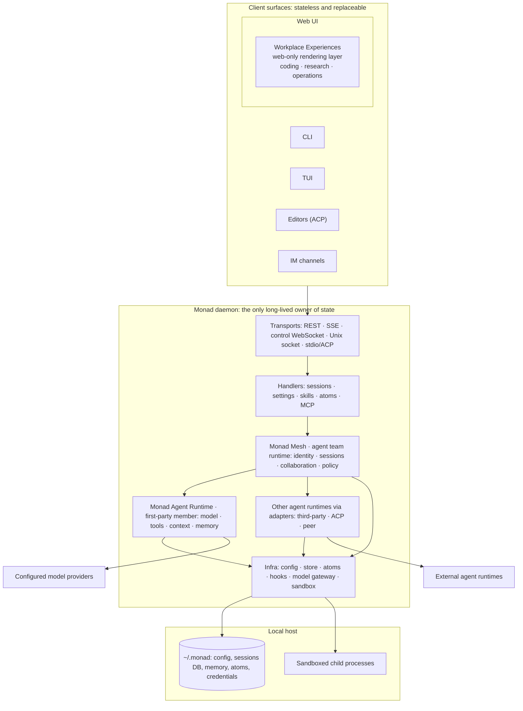
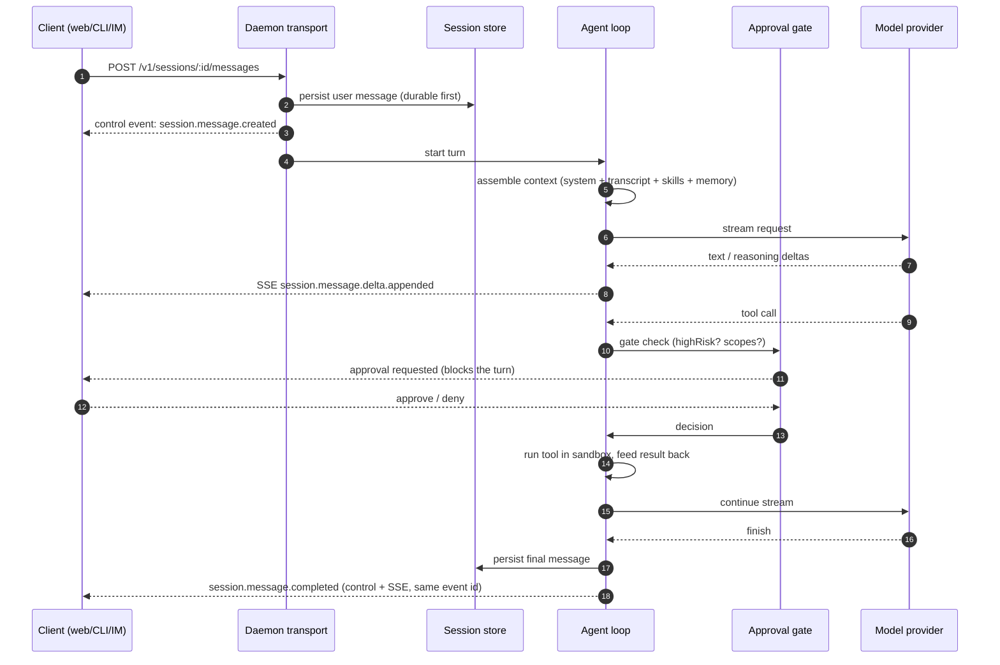
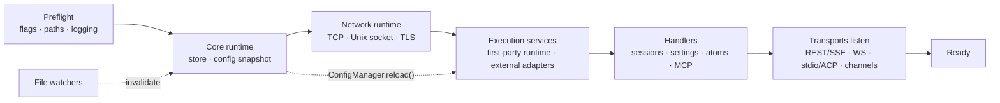
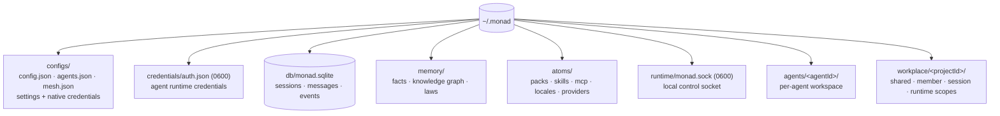
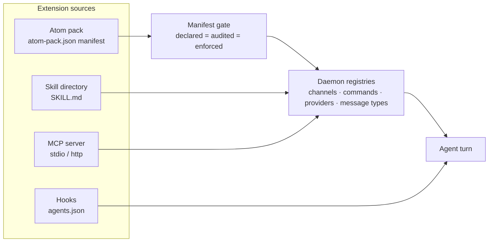
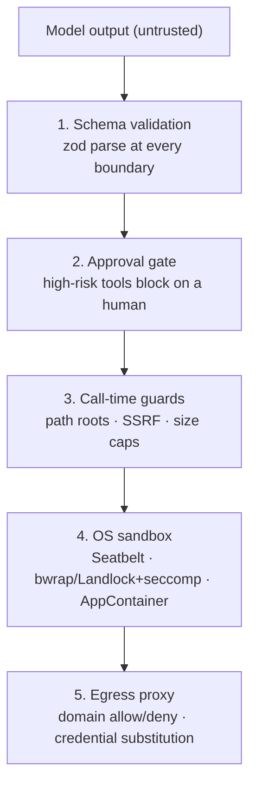

This developer-facing hub explains how the daemon owns Monad Mesh — the agent team runtime — while clients and agent runtimes attach through public contracts. Monad Agent Runtime is the first-party agent runtime that ships with it, one mesh member among several.

It answers three questions:

1. **What are the pieces?** See the layer map below
2. **How does the first-party agent execute a turn?** Follow the request walkthrough
3. **Where should you read next?** Choose one internals category

Internals are grouped by the part of the system they describe:

| Category | Question it answers | Read when |
|---|---|---|
| [`agent-team-runtime/`](/internals/agent-team-runtime/index) | How does Monad Mesh operate agents and runtimes as one team? | Changing team identity, collaboration, delegation, federation, or experiences |
| [`agent-runtime/`](/internals/agent-runtime/index) | How does the first-party agent runtime execute a turn? | Changing its tools, context, memory, or execution semantics |
| [`infra/`](/internals/infra/index) | How does the process run, bind, store, and load extensions? | Changing transports, config, storage, atoms, hooks, or the model gateway |

User-facing feature docs live in [`../usage/`](/usage/index); repo norms live in
[`../engineering/`](/engineering/index).

## 1. The layer map

Everything in Monad follows one rule: **the daemon owns state, clients only render and
control it.**

Three consequences worth internalising before reading any deeper doc:

- **No client is authoritative.** Closing the browser does not stop a turn; a CLI, a
  Telegram message, and an editor can drive the same session.
- **Workplace Experiences are a web-UI feature, not a runtime layer.** They live inside
  `apps/web` and re-render a project's page; the CLI, TUI, editors, and channels do
  not go through them. A capability that must exist on every surface belongs in the
  daemon, including tools, commands, hooks, and protocol. It never belongs only in an experience.
- **Everything crossing the process edge is parsed and never trusted**: HTTP, WebSocket,
  disk, MCP, atom packs, and model output alike. See
  the [runtime security model](/internals/infra/runtime#security-model).

## 2. How the first-party agent executes a request

This sequence describes Monad Agent Runtime, the first-party member. Other agent runtimes use their adapter and observation contracts instead.

Three invariants this diagram encodes:

- **Durable before published.** State is committed to the store, then the event is
  emitted. A reconnecting client never sees an event for state it cannot fetch.
- **Two planes, never merged.** Low-volume lifecycle rides the control WebSocket;
  token deltas ride a per-message SSE stream. Details:
  [`infra/realtime-channels.md`](/internals/infra/realtime-channels).
- **The gate is fail-closed.** A high-risk tool with no gate available is denied, not
  allowed. Details: [`agent-runtime/tools.md`](/internals/agent-runtime/tools).

## 3. How the process comes up

Startup is a topologically ordered lifecycle graph, not an ad-hoc `main()`. Hot reload
is deliberately conservative: trailing debounce, single-flight, commit-on-success. Full
module table: [`infra/daemon-architecture.md`](/internals/infra/daemon-architecture).

## 4. Where state lives

Path layout is owned in one place (`@monad/environment`), including the XDG split on
Linux. See [`infra/runtime.md`](/internals/infra/runtime). Managed project scope
and access rules are documented in
[`agent-team-runtime/project-sessions.md`](/internals/agent-team-runtime/project-sessions#managed-workspace-scopes).

## 5. How the system is extended

Extension is declare-then-register: a manifest declares kinds, the host audits them, the
runtime enforces them.

Built-in **tools are not an atom kind**. They ship with the daemon so their security
guards stay first-party. Details: [`infra/atoms.md`](/internals/infra/atoms),
[`../usage/skills.md`](/usage/skills), [`infra/hooks.md`](/internals/infra/hooks).

## 6. Containment layers

Each layer assumes the one above it failed. The [runtime security model](/internals/infra/runtime#security-model) explains the threat boundary, and [sandbox backends](/usage/sandbox-backends) records per-platform enforcement.

## Read next

**Monad Mesh: [`agent-team-runtime/`](/internals/agent-team-runtime/index)**

| Doc | Covers |
|---|---|
| [mesh-observation.md](/internals/agent-team-runtime/mesh-observation) | Observing external agent runtimes: raw and convenience planes |
| [mesh-adapter-authoring.md](/internals/agent-team-runtime/mesh-adapter-authoring) | Writing an adapter for a third-party agent runtime |
| [project-sessions.md](/internals/agent-team-runtime/project-sessions) | Projects, durable member identity, and per-session bindings |
| [acp.md](/internals/agent-team-runtime/acp) | ACP both ways: Monad as editor agent, and delegating to ACP agents |
| [peer-federation.md](/internals/agent-team-runtime/peer-federation) | Daemon-to-daemon delegation between machines you own |
| [workplace-experiences.md](/internals/agent-team-runtime/workplace-experiences) | The experience SDK boundary and host API |

**Monad Agent Runtime: [`agent-runtime/`](/internals/agent-runtime/index)**

| Doc | Covers |
|---|---|
| [tools.md](/internals/agent-runtime/tools) | Built-in tool registry, the `register` contract, security rules |
| [context-management.md](/internals/agent-runtime/context-management) | The gentle cascade: eviction, summarization, recitation, retrieval |
| [memory.md](/internals/agent-runtime/memory) | L1 Markdown facts, L2 knowledge graph, L3 laws, consolidation |
| [operation-source.md](/internals/agent-runtime/operation-source) | Immutable session provenance and server-stamped transport context |

**Infra: [`infra/`](/internals/infra/index)**

| Doc | Covers |
|---|---|
| [runtime.md](/internals/infra/runtime) | Binding, transports (TCP/UDS), configuration, env vars, security model |
| [headless-runtime-contract.md](/internals/infra/headless-runtime-contract) | Daemon authority, public contract catalog, retry boundaries, and verified local-mesh invariants |
| [daemon-architecture.md](/internals/infra/daemon-architecture) | Startup graph, lifecycle modules, hot reload, extension boundaries |
| [realtime-channels.md](/internals/infra/realtime-channels) | Control WebSocket vs per-message SSE, ordering and recovery rules |
| [model-providers.md](/internals/infra/model-providers) | Provider catalog, native vs OpenAI-compatible strategies, auth |
| [atoms.md](/internals/infra/atoms) | Atom pack system: declared kinds, conflicts, installation |
| [hooks.md](/internals/infra/hooks) | Lifecycle hook events, value contract, dispatch semantics |
| [third-party-commands.md](/internals/infra/third-party-commands) | Slash commands contributed by atom packs |
| [channel-conformance.md](/internals/infra/channel-conformance) | The contract every IM channel adapter is pinned to |
| [host-interactions.md](/internals/infra/host-interactions) | Schema-driven user input across Web, TUI, CLI, and ACP |
| [`apps/web/docs/router.md`](https://github.com/Monadix-AI/monad/blob/main/apps/web/docs/router.md) | The web UI router: a Vite-built TanStack Router SPA (lives with the app) |
