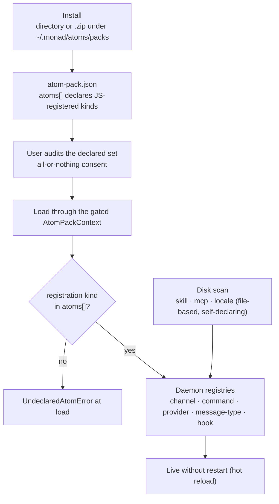

Monad has a **unified atom pack system**: one atom pack can contribute channels,
commands, skills, MCP servers, locale packs, hooks, message types, model providers, sandbox
backends, agent adapters, and workplace experiences. (**Tools are not an atom kind** — they are always
first-party and built into the daemon; atom packs cannot contribute them. See "Why tools aren't
atoms" below.) An atom pack **declares the JS-registered atom kinds it uses**; the host shows those
to you for audit, and **enforces them at runtime**. File-based kinds
(`skill`, `mcp`, `locale`) are self-declaring — the daemon discovers them from disk and no JS
declaration is needed. The whole authoring surface is the single `@monad/sdk-atom` package.



## The capability model

```ts
import { defineAtomPack, SDK_COMPATIBILITY_RANGE } from '@monad/sdk-atom';

export default defineAtomPack({
  manifest: {
    name: 'my-atom-pack',
    version: '1.0.0',
    sdkVersion: SDK_COMPATIBILITY_RANGE,
    atoms: ['channel'], // ← declared, auditable, enforced
  },
  channels: [myChannel],
});
```

`sdkVersion` is a semver compatibility range. `SDK_COMPATIBILITY_RANGE` derives its default from
the installed `@monad/sdk-atom` package version, so an author does not duplicate that version in
source. The daemon resolves its own SDK version from the same package manifest and rejects packs
whose range does not contain it.

- **Declared = audited + enforced.** An atom pack that declares `['channel']` cannot
  `registerProvider` — that throws `UndeclaredAtomError` at load. An atom pack gets a capability
  only after the user audits and consents to it (default-deny).
- **JS-registered atoms** (`channel` / `command` / `message-type` / `provider` /
  `hook` / `sandbox` / `agent-adapter` / `workplace-experience`) are enforced in-process via the
  gated `AtomPackContext` — must be listed in `atoms[]`. The full enum is `atomKindSchema` in
  [`packages/protocol/src/atom-pack.ts`](https://github.com/Monadix-AI/monad/blob/main/packages/protocol/src/atom-pack.ts).
- **File-based atoms** (`skill` / `mcp` / `locale`) bypass the JS gate entirely. The daemon scans
  for them on disk; file presence = self-declaration. No `atoms[]` entry needed (optional if you
  want to advertise them in the consent UI).
- **Resource capabilities** (`network`, `fs`, `llm`) are *audit-only* today — in-process JS can't
  be stopped from calling `fetch`/`node:fs`. True runtime enforcement requires the out-of-process
  adapter host (a later phase). Don't assume a declared resource cap is sandboxed yet.

## Bundling multiple atoms in one pack

One pack can ship several atoms at once — declare every kind it touches in `atoms[]` and provide the
matching payload arrays. This is the "one submission, many atoms" shape: a vendor publishes a single
pack that adds a channel, a few slash commands, a provider, and a custom message type together.

```ts
import { defineAtomPack, SDK_COMPATIBILITY_RANGE } from '@monad/sdk-atom';

export default defineAtomPack({
  manifest: {
    name: 'acme',
    version: '1.0.0',
    sdkVersion: SDK_COMPATIBILITY_RANGE,
    atoms: ['channel', 'command', 'provider', 'message-type'], // declare ALL kinds used
  },
  channels: [acmeChannel],
  commands: [acmePing],
  providers: [acmeProvider],
  messageTypes: [acmeBadge],
});
```

A registration whose kind isn't in `atoms[]` throws `UndeclaredAtomError` at load — so the manifest
is an honest, auditable inventory. The user consents to the whole declared set (all-or-nothing); the
CLI/web list each kind before install. A complete reference lives in
[`packages/sdk-atom/examples/multi/atom-pack.ts`](https://github.com/Monadix-AI/monad/blob/main/packages/sdk-atom/examples/multi/atom-pack.ts).
For command authoring, including structured args and subcommands, see
[`docs/internals/infra/third-party-commands.md`](/internals/infra/third-party-commands).

### Conflict & failure semantics

Same identifier claimed by two atoms. The policy is **per atom kind**, but the kinds fall into three
families with one shared resolution rule:

**Family 1 — namespace-coexist + pinnable** (`channel`, `command`, `skill`).
Nothing is rejected: every atom is registered under a fully-qualified name
(`<packId>__<name>`, commands as `/<packId>.<command>`), so two same-named atoms simply become two
distinct qualified names — the model/user/config can always address either explicitly. The **bare
name** resolves to a single winner: **first-wins by sorted pack folder name** by default, which the
**user can override by pinning** a specific pack for that id (once pinned, the bare name always
resolves to it). Built-in `command` names are **reserved** — a third-party pack can ship
`/<packId>.deploy` but can never take the bare `/deploy`. The fully-qualified name is always the
escape hatch when two packs collide on the bare name.

**Family 2 — globally unique, hard fail** (`provider`). A `provider.type` is the gateway's global
routing key and the key credentials/profiles bind to in `config.json`, so it cannot be namespaced or
coexist. A duplicate `type` is a **hard conflict**: at startup the colliding registration is rejected
with an error (not a silent first-wins); a dynamic **install fails** if its provider type is already
taken. This also prevents a third-party pack from shadowing a built-in provider (e.g. claiming
`openai`) to hijack its routing.

**Family 3 — set semantics** (`message-type`, `locale`, `hook`, `mcp`):
- **`message-type`** is namespaced under the pack id (`<packId>:<type>`) — cross-pack types never
  collide; registering the same id twice within a pack throws.
- **`locale`** is **pick-one, not merged**: only one pack is active per locale tag (user-installed
  wins, then atom packs sorted by folder name, then builtin). The active pack replaces others
  wholesale; keys it doesn't translate fall back to `en` via the normal fallback chain. Locale files
  live in `<packDir>/locales/<lng>/<namespace>.json` (one file per namespace); user-managed
  packs in `~/.monad/atoms/locales/`.
- **`mcp`** servers are registered by name (`mcpServers.<name>` in the JSON config). Each atom pack
  ships an optional `mcp.json`; user-managed configs go in `~/.monad/atoms/mcp/`. Three transport variants:
  `stdio` (external CLI), `http` (remote SSE/streamable-HTTP), and bundled (deferred — packed
  server binary, TBD).
- **`hook`** is **additive**: every hook for an event runs; there is no identifier and no dedup.

> **Rollout status.** `provider` hard-unique, `locale` file-based pick-one (user-dir > atom packs
> sorted > builtin), `mcp` file-based (daemon scans `<packDir>/mcp.json` + `~/.monad/atoms/mcp/*.json` at
> startup), `skill` file-based (daemon scans `<packDir>/skills/*/` + `~/.monad/atoms/skills/*/`),
> `channel` namespace-coexist + pin, `command` namespace-coexist + pin (built-ins reserved),
> `message-type` namespacing, and `hook` additivity
> are all live. Remaining: conflict-surfacing UI for skill bare-name collisions; bundled MCP
> server variant (cross-language, deferred).

**Cross-cutting:**
- **Same pack, duplicate id** is always an authoring bug → that pack aborts on the duplicate; atoms
  registered before it stay, later ones are skipped.
- **The user pin** is the one resolution override across Family 1 + locale: unset → first-wins; set →
  always resolves to the pinned pack. Collisions are surfaced in the UI (global settings + the
  in-use agent view) so the user can pin/rename/disable rather than silently accepting first-wins.
- **Partial failure is not rolled back.** A multi-atom pack registers atom-by-atom; if one throws,
  the already-registered siblings remain and the failure is reported per-pack via `onError`. Packs
  are independent — one failing pack never blocks another.

### Why tools aren't atoms

Tools are the agent's hands — `fs`, `shell`, `code_exec`, `web_search`, MCP bridges, and so on — and
they run **in-process with the daemon's full authority**, gated only by the sandbox and credential
wrappers the daemon owns. Letting a third-party atom pack contribute a tool would hand untrusted code
that authority directly. So tools are **always first-party**: they live in the daemon
(`apps/monad/src/capabilities/tools`) and are wired straight into the tool registry at startup, never through the
atom-pack loader. Atom packs extend the agent's *reach* (channels, providers, commands)
but never its *hands*. MCP servers remain the supported path for adding external tool-like
capability — they run out-of-process behind their own trust prompts.

### Hot install

Installing a pack re-runs discovery without a daemon restart. Channels, locales, providers,
**commands, hooks, skills, and MCP servers** become usable immediately.

The sweep builds the new set before replacing the old one, so a pack that fails to load
leaves the previous set serving. Registrations are dropped wholesale — but anything
`register()` started (a timer, socket, watcher, child process) outlives them, so a pack that
acquires resources should implement `deactivate()`:

```ts
export default defineAtomPack({
  manifest: { /* … */ },
  channels: [myChannel],
  deactivate: () => clearInterval(pollTimer)
});
```

It runs once per pack, after the replacement set is live and in-flight work has drained. It
must be idempotent; a teardown that throws is logged and does not fail the sweep.

## Authoring a channel

A channel lets an external IM platform (Telegram, Slack, …) reach the agent. The adapter does
**only platform I/O** — it never sees a `sessionId`, the store, the bus, or agent events. The core
owns the conversation→session mapping and renders agent output to your `send()`/`editMessage()`.

```ts
import { defineChannel } from '@monad/sdk-atom';

export const myChannel = defineChannel({
  type: 'whatsapp', // any string — ChannelType is open, not a fixed enum
  name: 'WhatsApp',
  capabilities: { edit: false, typing: true, threads: false, maxMessageChars: 4096, markdown: false },
  envVars: [{ name: 'WHATSAPP_TOKEN', description: 'API token', required: true, secret: true }],
  create(ctx) {
    // ctx: { onMessage, log, config: {id,type,label}, secrets, signal }
    return {
      type: 'whatsapp',
      capabilities: { edit: false, typing: true, threads: false, maxMessageChars: 4096, markdown: false },
      async connect() {
        /* open your socket / start your poll loop; push inbound via ctx.onMessage(...) */
      },
      async disconnect() {},
      async send(chatId, content, opts) {
        /* deliver to the platform */ return { ref: 'platform-msg-id', chatId };
      },
    };
  },
});
```

Inbound is normalized to `ChannelInbound` (`chatId`, `userId`, `threadId?`, `text`, `kind`,
`command?`, `nativeMessageId`, `isSelf`, `chatType?`, `mentionedSelf?`, …) — **no session field**.
Slash commands (`/new`, `/switch`, `/sessions`, `/archive`, …) are interpreted by the core, not your atom
pack; just normalize them to `kind: 'command'`.

**Set `chatType` and `mentionedSelf` on group platforms.** The core's group gate is
host-owned — your adapter just feeds them signal:

- `chatType`: `'dm'` (default if omitted), `'group'`, or `'channel'`.
- `mentionedSelf`: `true` when the bot was @mentioned or the message replies to the bot. In a group
  the core stays silent unless `mentionedSelf` (or a slash command) — see `groupPolicy.requireMention`.

Per-user rate limiting and the per-channel `agentHint` are host-owned. Your adapter only does
platform I/O.

Reference adapters live in `packages/atoms/src/channels/`, spanning four inbound styles:

- **Long-poll / dial-out WebSocket / TCP (no public URL):** `telegram.ts` (getUpdates),
  `discord.ts` / `qq.ts` (Gateway WS), `slack.ts` (Socket Mode WS), `irc.ts` (raw TCP via
  `Bun.connect`).
- **Inbound webhook (HTTP listener):** `line.ts`, `whatsapp.ts`, `twilio.ts`, `feishu.ts`,
  `wecom.ts`, `teams.ts`, `google-chat.ts`, `imessage.ts` (BlueBubbles), plus the generic
  `webhook.ts`. These share `_http-inbound.ts` — a helper that owns the `Bun.serve` listener, GET
  URL-verification handshakes, raw-body HMAC signature checks (`hmacSha256Hex/Base64`,
  `hmacSha1Base64`, `timingSafeEqual`), and fan-out to `ctx.onMessage`; the adapter supplies
  verify/parse + its own outbound `send()`.
- **Local IMAP poll:** `email.ts` (raw IMAP over TLS + SMTP, hand-rolled, plain-text/no-IDLE).
- **Child process:** `signal.ts` (drives `signal-cli jsonRpc` via `Bun.spawn` — Signal has no bot API).

All 16 are zero-runtime-dependency (only `fetch` / `WebSocket` / `Bun.connect` / `Bun.spawn` /
`crypto.subtle` / `node:crypto`). There is **no personal-WeChat adapter** (no official API; bridges
violate ToS) — use **WeCom (`wecom.ts`)**.

Outbound auth patterns to copy: static bearer (LINE/WhatsApp/Discord), HTTP Basic (Twilio),
client-credentials token exchange with caching (Feishu/WeCom/Teams), and service-account RS256 JWT →
OAuth (Google Chat). Each adapter's pure `normalize*` fn is unit-tested; the network/auth I/O is
best-effort (only exercisable with live credentials).


**Scaffold a new one:** `monad atom scaffold <type> [dir]` writes a ready-to-build channel atom pack
(`atom-pack.ts` + `atom-pack.json` + `package.json` + `README.md`) with the contract stubbed and the
host-owned concerns documented inline. Then `bun install && bun run build` and
`monad atom install local:<dir>`.

## Authoring a model provider

A `provider` atom adds a model backend (a new vendor, a self-hosted gateway, …). The contract is
**ai-sdk-free**: you implement a Monad-native `stream()` returning `ModelChunk`s — a third-party
provider can talk raw HTTP and never touch the Vercel AI SDK. (Monad's own first-party providers
in `@monad/atoms/src/providers` happen to use ai-sdk internally via a shared adapter, but that's
an implementation detail, not part of the contract.)

```ts
import { defineProvider, defineAtomPack, SDK_COMPATIBILITY_RANGE } from '@monad/sdk-atom';

const myProvider = defineProvider({
  type: 'my-vendor', // open string; also the Provider.type stored in config.json
  // Self-describing metadata — the daemon assembles the provider catalog (UI/CLI picker, base-url
  // hint, key placeholder, extra fields) from every registered provider's descriptor.
  descriptor: { type: 'my-vendor', label: 'My Vendor', strategy: 'native', keyPlaceholder: 'mv-…' },
  // The only required method. The gateway resolves a profile → provider + credential and calls it;
  // yield Monad-native chunks (text / reasoning / tool-call / usage). Throw on a request error so
  // the gateway can fail over to the next credential/model in the chain.
  async *stream(call) {
    // call: { modelId, messages, tools?, params, provider, credential, signal?, fetch? }
    yield { type: 'text', token: 'hello' };
    yield { type: 'usage', usage: { inputTokens: 1, outputTokens: 1 } };
  },
  // Optional: complete() (else the gateway aggregates stream), generateImage/generateSpeech,
  // listModels (powers the connection test + model picker; attach `price` for native pricing),
  // countTokens (native exact count; best-effort, resolve undefined on error).
});

export default defineAtomPack({
  manifest: {
    name: 'my-vendor',
    version: '1.0.0',
    sdkVersion: SDK_COMPATIBILITY_RANGE,
    atoms: ['provider'],
  },
  providers: [myProvider],
});
```

The gateway only ever sees the Monad-native `ModelChunk`/`ModelResult` — it owns the
credential-fallback chain, retries, cost accounting, and stamps the resolved provider/model onto
usage. `ModelPrice` and the pricing parsers live in `@monad/protocol` so both the gateway and
provider atoms can attach `price` to a `ModelInfo`.

## Testing offline

```ts
import { createChannelTestHarness } from '@monad/sdk-atom';

const h = createChannelTestHarness(myChannel, { secrets: { token: 'x' } });
// drive your platform mock, then assert what the adapter normalized:
expect(h.received[0]?.text).toBe('hello');
// assert outbound hit your platform mock by spying on it; h.dispose() aborts the signal.
```

## Packaging & distribution

Authors build a **self-contained single-file bundle** (SDK + dependencies inlined) and commit
`atom-pack.json`, the manifest entry, and declared file-based atoms/assets to a GitHub repository.
The installing machine does not run Bun, TypeScript, package-manager, build, postinstall, or other
lifecycle scripts. The daemon resolves the selected repository ref to a commit, downloads those
prebuilt files, verifies the manifest bundle integrity when declared, asks for consent, and deploys it.

Install with `monad atom install <source>` (CLI) or `POST /v1/atoms/install`:

- **GitHub repository**: `github:owner/repo[@ref]` or a GitHub URL. The repository must contain the
  prebuilt Atom Pack at its root (or at the selected URL subdirectory); private repos use the token
  stored directly in `config.json.atomRegistries.github`.
- **Local development directory**: `local:/abs/path` (a prebuilt Atom Pack directory).
- **Drop-in**: place `<name>/{atom-pack.json, dist/atom-pack.js}` in `~/.monad/atoms/packs/` directly.

GitHub and local installs record a revision. `GET /v1/atoms/:name/update` checks the recorded source;
`POST /v1/atoms/:name/update` requires `{ "confirm": true, "revision": "<checked revision>" }` before
replacing the installed files. If the source changes after the check, the daemon requires a new check.

`monad-power-pack` is not a privileged built-in. Monad's own release workflow publishes it as the
same canonical ZIP, and it enters the same checksum, manifest, consent, permission, install, and
runtime registration path as any third-party pack.

Installs **dedup by source identity** (version-independent: `github:owner/repo`, `npm:name`, `local:path`).
Re-installing the same source — even at a new release tag or npm version — updates the existing dir in
place rather than creating a duplicate. Two **different** sources that share a manifest name **coexist**:
the second installs under a disambiguated dir `<name>-<sourceHash>` rather than clobbering, so two
developers' same-named packs both install. The **operable identity is the install dir (folder) name**
(unique) — `monad atom remove/enable` + the conflict pin all key on it; `listAtomPacks` returns it as
`name` with the manifest name as `displayName`.

The install API is **default-deny**: the first call returns `needsConsent: true` with the atom pack's
declared `atoms` and any static-scan `warnings`; re-call with `consent: true` (CLI: `--yes`)
to proceed. Before writing, the pipeline verifies the bundle `integrity` hash (rug-pull guard) and
checks `sdkVersion` compatibility. A successful install/remove re-discovers atom packs so a new channel
type is usable once you add its channel config — no daemon restart.

CLI: `monad atom list | install <source> [--yes] | update [<name>] | remove <name> | scaffold | pack`.
`update` re-installs the exact recorded Release tag or npm version. Install a new tag/version to move
to a newer artifact; source identity keeps it in the same directory. Re-consent applies unless
`--yes`. Drop-ins have no recorded source and are skipped.
HTTP: `GET /v1/atoms`, `POST /v1/atoms/install`, `DELETE /v1/atoms/:name`.

## Authoring file-based atoms (skill / mcp / locale)

File-based atoms require no JS code — drop the right files into your atom pack and the daemon
discovers them automatically. No `atoms[]` declaration is required (though you may list them to
advertise them in the consent UI before install).

### Skill

Ship one directory per skill under `skills/` in your pack root:

```text
my-atom-pack/
└── skills/
    └── code-reviewer/
        ├── SKILL.md          ← required — skill instructions for the agent
        ├── FORMS.md          ← optional companion doc
        └── scripts/
            └── lint.sh       ← optional scripts referenced in SKILL.md
```

`SKILL.md` follows the standard skill format (YAML frontmatter + markdown body — see
[skills](/usage/skills) for the full format and invocation model). After install
the agent can load the skill by name. User-managed skills live in `~/.monad/atoms/skills/` with the
same layout and take precedence.

**Security**: before consent, the agent cannot read any skill content (not even `SKILL.md`). After
consent, `shell_exec`/`code_exec` calls from skill instructions go through the session's normal
oversight gate — no special restrictions.

### MCP server

Ship a `mcp.json` at your pack root using the industry-standard MCP server format:

```json
{
  "mcpServers": {
    "github-tools": {
      "command": "npx",
      "args": ["-y", "@modelcontextprotocol/server-github"],
      "env": { "GITHUB_TOKEN": "${env:GITHUB_TOKEN}" }
    },
    "my-remote": {
      "url": "https://mcp.example.com/sse"
    }
  }
}
```

Two transport variants:
- **`stdio`**: `command` + `args` + optional `env`. Launched as a child process.
- **`http`**: `url` pointing to an SSE or streamable-HTTP MCP endpoint.

User-managed MCP configs: place `~/.monad/atoms/mcp/<any-name>.json` with the same format. The daemon
scans both locations at startup and on atom pack rediscovery.

### Locale pack

Ship locale files one namespace per file, under a directory per locale tag:

```text
my-atom-pack/
└── locales/
    └── zh-TW/
        ├── cmd.json          ← flat key-value for cmd.* keys
        └── web.json          ← flat key-value for web.* keys
```

All namespace files for a locale tag are merged into a single flat message set at load time. Keys
are flat, dotted strings (`cmd.new.started`) — the JSON is never nested. A pack only needs to
ship keys it translates; missing keys fall back to `en` automatically.

User-managed locale packs: place files in `~/.monad/atoms/locales/<lng>/<namespace>.json` (no pack
subdirectory — treated as one anonymous pack). User-installed locale wins over atom pack locale
for the same tag.

## Security model (summary)

- Narrow `ChannelContext` — defense in depth: an atom pack's channel adapter can't reach the agent's
  tools or internals; it does platform I/O only.
- Capability declaration + user consent + runtime enforcement (least privilege).
- **The consented manifest is authoritative, not the bundle.** The runtime gate is built from the
  on-disk `atom-pack.json` `atoms` — the artifact the user audited and consented to at install — not
  from the `manifest` the bundle embeds in its own `defineAtomPack()`. A bundle can self-declare any
  set; trusting it would let an installed pack register atom kinds the user never approved. At
  discovery the loader also refuses a bundle whose embedded `atoms` exceed the consented set (a
  drift signal — reinstall to re-consent). Drop-ins with no `atoms` in `atom-pack.json` are gated
  default-deny (empty grant).
- **Load order is stable** (atom-pack dirs sorted by folder name), so cross-pack first-wins conflict
  resolution is reproducible across machines rather than filesystem-order-dependent.
- SHA/integrity pinning (rug-pull guard) and `sdkVersion` checks on install.
- Channel platform sender ids are used only for rate limits and conversation routing;
  every channel session still sends high-risk tools through the oversight gate.
