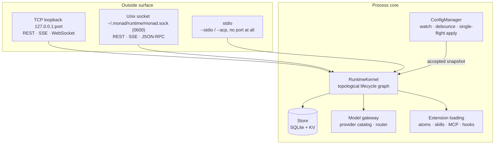
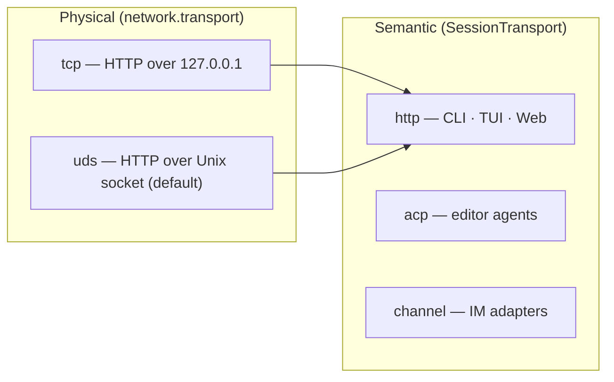
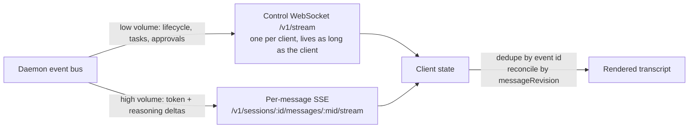

Infra is everything that exists before a single agent turn runs: the process itself, how
it binds and speaks, where it keeps state, and how third-party code is loaded into it.

## The two axes people confuse

**Physical transport** is *how bytes travel*: `tcp` or `uds`. **Semantic transport** is
*who may write a session*: `http`, `acp`, or `channel`. Both TCP and UDS connections are
`http` semantically. Read [runtime.md](/internals/infra/runtime) before touching either.

## Realtime: two planes, never merged

A token flood must never starve approval delivery — that is the entire reason for the
split. Rules, resume semantics, and the conformance checklist:
[realtime-channels.md](/internals/infra/realtime-channels).

## Documents

| Doc | Covers |
|---|---|
| [runtime.md](/internals/infra/runtime) | Binding, physical transports, configuration, env vars, security posture |
| [daemon-architecture.md](/internals/infra/daemon-architecture) | Startup graph, lifecycle module table, hot reload, ownership rules |
| [realtime-channels.md](/internals/infra/realtime-channels) | Channel map, message lifecycle, client state machine, recovery |
| [model-providers.md](/internals/infra/model-providers) | Provider catalog as source of truth, native vs OpenAI-compatible, auth |
| [atoms.md](/internals/infra/atoms) | Atom pack manifest gate, atom kinds, conflict semantics, installation |
| [hooks.md](/internals/infra/hooks) | The thirteen lifecycle events, hook value contract, dispatch |
| [third-party-commands.md](/internals/infra/third-party-commands) | `defineCommand()` slash commands from atom packs |
| [channel-conformance.md](/internals/infra/channel-conformance) | Normalization and routing contract for IM adapters |
| [host-interactions.md](/internals/infra/host-interactions) | Schema-driven user input across Web, TUI, CLI, ACP |

## Documented with their package

Single-package detail lives next to the code that implements it:

| Doc | Covers |
|---|---|
| [`apps/web/docs/router.md`](https://github.com/Monadix-AI/monad/blob/main/apps/web/docs/router.md) | The embedded TanStack Router SPA: routes, dev server, code splitting, production serving |
| [`packages/sandbox/docs/hardening.md`](https://github.com/Monadix-AI/monad/blob/main/packages/sandbox/docs/hardening.md) | Per-platform confinement status, egress filtering, known gaps |
| [`packages/sandbox-vm/docs/conformance.md`](https://github.com/Monadix-AI/monad/blob/main/packages/sandbox-vm/docs/conformance.md) | What counts as VM-sandbox confinement evidence, and how to produce it |

Related: [`../../engineering/architecture.md`](/engineering/architecture) for
package boundaries, [`../../usage/mcp.md`](/usage/mcp) for connecting MCP servers.
