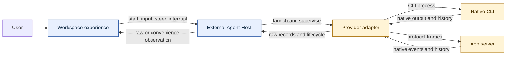
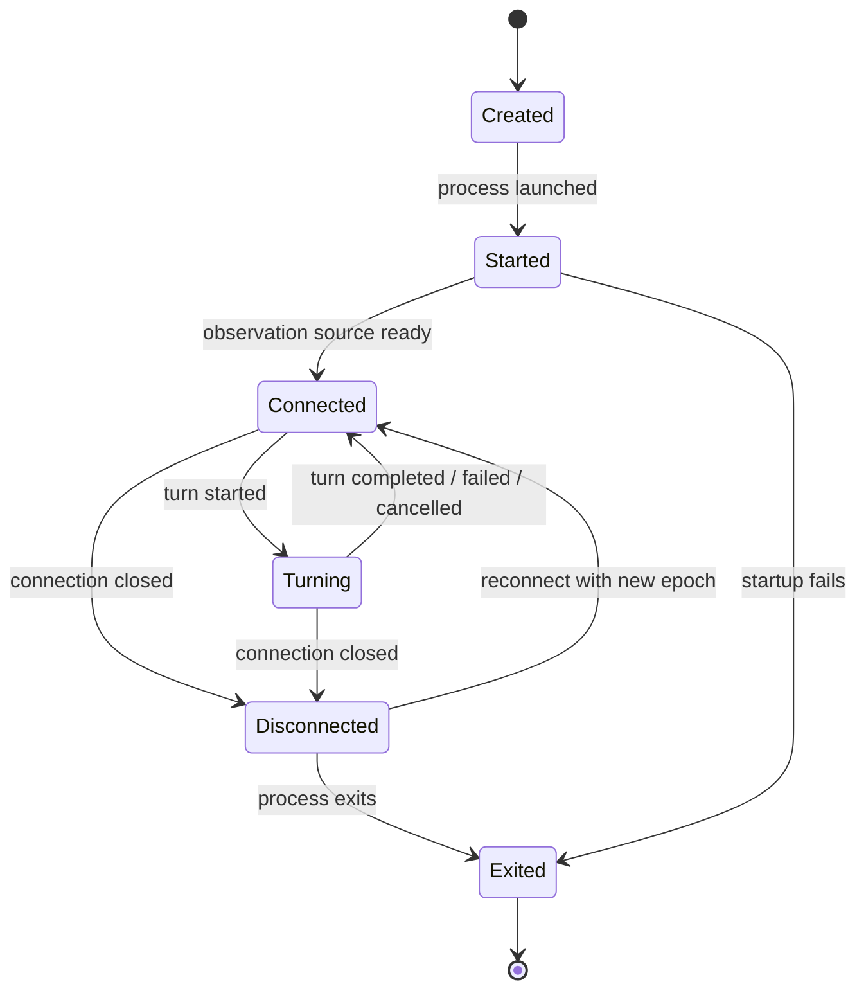
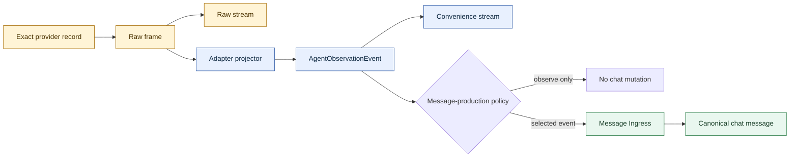

# Understand external-agent adapters and events

External agents let Monad supervise a provider's native coding agent while keeping
the provider's protocol, authentication, and session semantics intact. An adapter
describes how to launch and control the provider, how to acquire its exact events,
and how to project those events into Monad's provider-neutral observation contract.
Users get one consistent experience; adapter authors keep provider-specific behavior
at a narrow boundary.

This guide begins with the user model, then follows one event from the provider to
the user interface (UI) and finishes with the adapter contract and implementation
checklist.

## The short version

- Monad owns the process, connection, authorization, session, and resource limits.
- An external-agent adapter owns provider-specific launch arguments, wire framing,
  input and approval commands, raw history access, and event projection.
- Every accepted provider record first enters a raw observation plane unchanged.
- A pure adapter projector maps the same raw record to an
  `AgentObservationEvent` for provider-neutral experiences.
- Raw and convenience observation are views of the same source, not two ingestion
  paths.
- Observation is not chat history. Only an explicit message-production policy may
  send selected events through Message Ingress.

## What users experience

An **external agent** is a provider-native agent that Monad launches or connects to
and presents inside a workspace. You select the agent, model, working directory,
and supported runtime options. Monad then supervises the runtime and exposes its
progress through a common observation experience.

The provider remains responsible for model behavior, authentication, native session
identity, and any provider-owned approval protocol. Monad supplies the common shell:
workspace membership, lifecycle controls, access checks, observation, and message
routing.



The adapter boundary prevents provider details from leaking into the workspace UI.
An experience renders `reasoning`, `tool-call`, or `turn-end`; it does not branch on
provider event names such as `item/started` or `message_delta`.

### One lifecycle across providers

Runtime lifecycle and provider connectivity are related but different. A process can
be running before its observation source is ready, and a protocol connection can drop
while the supervised process still exists. Monad therefore announces connection state
separately from process state.



`external_agent.session.connection.opened` means clients may observe the provider.
It carries the external-agent session, provider, and an `observationEpoch` that names
that particular connection. `connection.closed` carries the same identity plus an
`exited`, `failed`, `stopped`, or `disconnected` reason.

The terminal observation frame and `connection.closed` use the same session, provider,
and epoch identity. They announce one closure through different delivery planes, so a
client must not treat them as two disconnects.

An **observation epoch** is the lifetime of one ready provider connection. Reconnects
create new epochs, so late frames and cached state from an older connection cannot be
mistaken for current activity.

### Two integration families

Adapters support two broad ways to operate a provider. Both produce the same lifecycle
and observation contracts.

| Integration family | How Monad communicates | Best fit | Important trade-off |
| --- | --- | --- | --- |
| Native command-line interface (CLI) | Pseudoterminal (PTY), stdin/stdout JavaScript Object Notation (JSON), remote-control mode, or a fresh process per turn | Providers whose supported product surface is a command-line program | Some capabilities depend on what the CLI exposes in the selected mode |
| App server | Structured frames over stdio, WebSocket, or Unix socket | Providers with a persistent protocol or gateway | Requires an initialization handshake and provider-specific request correlation |

The concrete `ExternalAgentLaunchMode` values are:

| Mode | Runtime shape | Input and events |
| --- | --- | --- |
| `pty` | One interactive process per session | Terminal input and provider terminal output |
| `json-stream` | One long-lived structured CLI process | Newline-delimited input and output records |
| `cli-oneshot` | A fresh process for each turn | Turn input in argv; provider session selectors preserve context |
| `remote-control` | Provider-specific remote control of a native runtime | Adapter-defined control surface and native output |
| `app-server` | One persistent protocol process or gateway | Structured requests, notifications, and responses over stdio, WebSocket, or Unix socket |

Capabilities are evaluated for the effective launch mode. For example, an adapter may
support approval resolution over its app-server channel but not through PTY or one-shot
execution. The UI should only offer controls that the active mode can complete.

## How provider events become observations

External-agent events pass through two observation planes:

- The **raw plane** preserves the exact accepted provider frame or history record and
  adds only routing and ordering metadata.
- The **convenience plane** carries provider-neutral `AgentObservationEvent` values
  produced by the adapter's projector.

Raw is the source of truth for observation. Convenience is a deterministic view of
that source.



This ordering creates an important failure boundary. If a projector cannot understand
a provider record, raw delivery still succeeds. The convenience plane may diagnose or
omit that projection, but it must not rewrite or suppress the raw record.

### Four event contracts have four jobs

Monad keeps provider data, observation, runtime facts, and chat messages separate. The
same native record may inform more than one contract, but each contract has one owner
and one delivery policy.

| Contract | Meaning | Delivery |
| --- | --- | --- |
| `ExternalAgentRawFrame` | The exact provider record plus routing and ordering metadata | Resource-scoped raw observation stream |
| `AgentObservationEvent` | A provider-neutral projection for reasoning, tools, messages, and turn state | Resource-scoped convenience observation stream |
| `external_agent.session.*` | Low-frequency lifecycle facts such as connection, turn, and approval transitions | Client-lifetime control channel |
| `session.message.*` | Canonical chat-message creation, deltas, completion, failure, update, and deletion | Control channel and message-scoped generation stream according to the event registry |

`parseOutput` may decode operational provider facts such as approval requests, session
references, or protocol errors. Raw observation capture still happens before that
decode. A lifecycle handler may then publish a domain fact, while the observation
projector independently derives the convenience event from the committed raw frame.

### The raw frame

For live text transports, `data` is the exact string frame Monad accepted. For provider
history, `data` is the exact native record returned by the adapter's raw history reader.
Projection, merging, and deduplication happen later.

```ts
type ExternalAgentRawFrame = {
  externalAgentSessionId: ExternalAgentSessionId;
  provider: ExternalAgentProvider;
  observationEpoch?: string;
  origin: 'live' | 'history';
  cursor: string;
  providerIdentity?: string;
  stream?: 'stdout' | 'stderr' | 'pty' | 'app-server';
  data: unknown;
  observedAt?: string;
};
```

`cursor` orders and resumes Monad delivery. `providerIdentity`, when the provider
supplies one, identifies the native event across live and history reads. These values
have different jobs and should not be substituted for one another.

Raw endpoints are privileged diagnostic surfaces because raw provider data may contain
sensitive prompts, tool input, file content, or credentials. Consumers need explicit,
resource-scoped authorization.

### The convenience event

The projector maps provider vocabulary into `AgentObservationEvent`. Its `kind` is one
of:

```text
turn-start        user-message       reasoning
tool-call         tool-result        assistant-message
turn-end          system             unknown
```

The event remains data-only. It can carry raw text, structured tool data, a turn-end
reason, streaming state, diagnostics, provider time, and non-empty raw provenance. It
does not carry UI components, labels, cards, or provider event-type strings.

| Provider fact | Neutral kind | Typical experience behavior |
| --- | --- | --- |
| A turn begins | `turn-start` | Mark the agent active |
| The provider records user input | `user-message` | Show the input that began or continued the turn |
| The model emits thinking text | `reasoning` | Coalesce streaming fragments into a reasoning block |
| A tool is invoked | `tool-call` | Render a tool activity item from structured data |
| A tool returns | `tool-result` | Update or append the matching result |
| The model emits answer text | `assistant-message` | Show provider output in the observation timeline |
| The turn settles | `turn-end` | Stop generating and record the outcome |
| The provider emits a system notice | `system` | Show a contained session or provider notice |
| The record has no known mapping | `unknown` | Preserve provenance and use a safe fallback |

The convenience stream is incremental:

```ts
type ExternalAgentConvenienceFrame =
  | { kind: 'ready'; observationEpoch?: string; historyBefore?: string }
  | { kind: 'upsert'; cursor: string; event: AgentObservationEvent }
  | { kind: 'remove'; cursor: string; eventId: string }
  | { kind: 'unavailable'; reason: string };
```

Stable event identifiers (IDs) let later deltas update a merged reasoning, message, or tool item.
`remove` retracts an earlier projected event without asking clients to replace the
entire timeline.

### Observation does not write chat

Observation answers, “What did the provider report?” Chat history answers, “What
messages did this workspace commit?” Those are different business records.

Reading history, reconnecting a stream, switching between raw and convenience views,
or re-projecting an event must have no chat side effects. If a product policy chooses
to turn a provider event into a chat message, it calls Message Ingress with an
idempotency key derived from the provider session and provider event identity. Replays
then return the existing message instead of duplicating it.

## Joining history and live events without gaps

A provider may expose current activity through its live transport before the same
records appear in native history. Monad bridges that delay with an ephemeral raw store
for the current observation epoch. It is a visibility cache, not a durable observation
journal.

```mermaid
sequenceDiagram
  participant UI as Observation experience
  participant Live as Live convenience stream
  participant History as Provider-native history

  UI->>Live: Subscribe first
  Live-->>UI: ready(epoch, historyBefore)
  Live-->>UI: Buffer new upsert/remove frames
  UI->>History: Read records before historyBefore
  History-->>UI: Page(records, coverage, nextCursor)
  UI->>UI: Project and deduplicate by provider identity/provenance
  UI->>UI: Release buffered live frames
  Live-->>UI: Continue ordered delivery
  Live-->>UI: Terminal close for epoch
  Note over Live,History: Epoch cache is deleted; later reads use provider-native history
```

The client subscribes before it fetches history. The initial `ready` frame supplies
`historyBefore`, the exact join boundary for that epoch. The client buffers newer live
frames, loads history before the boundary, deduplicates using provider identity and
provenance, then releases the buffer.

Provider-native history reports one of two coverage levels:

| Coverage | Guarantee |
| --- | --- |
| `exact` | The page is authoritative for the requested native records |
| `settled` | The provider exposes settled session records but not every transient transport delta |

When a connection closes, Monad sends a terminal frame, closes the epoch streams, and
deletes the live cache. Later history reads come from the provider. Monad does not
retain a second durable journal or synthesize transient records the provider cannot
recover.

## The adapter boundary

An adapter connects four layers:

1. **Provider definition** describes identity, discovery, settings, models, and
   supported modes.
2. **Runtime control** builds launch specifications and translates input, approval,
   resize, interrupt, steer, and stop operations.
3. **Raw acquisition** accepts live provider frames and reads exact provider-native
   history pages.
4. **Projection** converts raw records into `AgentObservationEvent` without UI logic.

The daemon host owns the process or socket lifecycle, working-directory scope,
authorization, connection epochs, raw-store commit, stream backpressure, and routing.
The adapter never needs to own workspace sessions, storage, or experience state.

### Core adapter responsibilities

The complete software development kit (SDK) interface contains discovery,
authentication, model, migration, and managed-runtime hooks. The following reduced
shape shows the responsibilities that matter to runtime adaptation:

```ts
interface ExternalAgentProviderAdapter {
  provider: ExternalAgentProvider;
  label: string;
  detect(): ExternalAgentPresetView;
  buildLaunch(agent, options): ExternalAgentLaunchSpec;

  initialize?(handle, context): void;
  parseOutput(chunk, handle?): ExternalAgentOutputEvent[];
  sendInput(handle, input): void;
  resolveApproval(handle, resolution): void;
  interrupt?(handle): void;
  steer?(handle, input): void;
  resize(handle, cols, rows): void;
  stop(handle): void;

  events: ExternalAgentEventSource;
  observation?: ExternalAgentObservationProjector;
}
```

The event source separates acquisition from projection. Its live side accepts
the provider record exactly once, while its history reader returns raw records and the
provider's native cursor. The projector is pure: given the same raw record and context,
it returns the same neutral events and provenance.

### App-server transport stays hidden

An app-server adapter receives one frame-oriented `send` and `close` interface. The
host decides whether bytes travel over the child process's stdio, a WebSocket, or a
Unix socket. This keeps authentication and protocol semantics in the adapter without
coupling it to daemon transport code.

App-server adapters usually perform four extra tasks:

1. send the provider's initialization handshake;
2. correlate responses with the original request kind;
3. translate server-initiated requests and notifications;
4. expose graceful turn controls only when the protocol supports them.

Do not infer a response type from its payload shape when the protocol supplies request
IDs. Record the request kind when sending and dispatch the response by that ledger.

## Observation APIs

The canonical Hypertext Transfer Protocol (HTTP) resources are scoped to an
external-agent session:

```text
GET /v1/external-agent-sessions/:id/stream/raw
GET /v1/external-agent-sessions/:id/stream/convenience
GET /v1/external-agent-sessions/:id/history/raw
GET /v1/external-agent-sessions/:id/history/convenience
GET /v1/external-agent-sessions/:id/connection
```

The raw and convenience history endpoints page by provider cursor. The connection
endpoint returns the current epoch, the `historyBefore` boundary, and a revision for a
race-free snapshot handshake. Unix clients using JSON Remote Procedure Call
(JSON-RPC) receive the same domain contracts. HTTP Server-Sent Events (SSE) are one
delivery format, not a separate event model.

Continuous observation uses resource-scoped subscriptions. Low-frequency lifecycle
facts such as `connection.opened` and `connection.closed` travel on the client-lifetime
control channel. High-volume raw records and projected observations do not enter that
global channel. There is no `external_agent.output` event on the global event bus;
provider output belongs to the observation streams.

## Build an adapter

Use this sequence when adding a provider:

1. **Declare the provider.** Supply an open provider ID, display label, product icon,
   discovery probe, settings, supported models, and supported launch modes.
2. **Build an exact launch.** Return argv, cwd, explicit environment additions,
   launch mode, app-server transport hints when needed, and truthful capabilities.
3. **Implement control.** Encode input and provider-owned approvals. Add interrupt,
   steer, resize, or graceful stop only where the effective mode supports them.
4. **Acquire raw live data.** Preserve the exact accepted string frame or structured
   provider record before parsing or normalization.
5. **Read raw history.** Return provider-native records, native identities and cursors,
   and an honest `exact` or `settled` coverage value.
6. **Project neutral events.** Map every known provider fact to
   `AgentObservationEvent`, attach complete raw provenance, and preserve unknown facts
   as safe `unknown` events when they carry user-visible information.
7. **Define stable identity.** Use provider event or item identity where available so
   live deltas, settled history, and reconnects converge on the same event.
8. **Test the seam.** Prove live and history join without gaps or duplicates, projector
   failure leaves raw delivery intact, reconnect creates a new epoch, and closed epochs
   cannot serve stale cached data.

### Contract tests that matter

Adapter tests should use real provider fixtures and assert full contract values. Cover
at least:

- byte-exact or value-exact raw preservation;
- raw history cursors, provider identity, and coverage;
- exact projected `AgentObservationEvent` values with non-empty provenance;
- streaming fragment merging and stable event identity;
- unknown record behavior;
- request/response correlation for app-server protocols;
- approval capability truthfulness for every supported launch mode;
- history/live joining at `ready.historyBefore`;
- raw delivery when projection throws;
- terminal close, cache deletion, and provider-native history after disconnect.

Daemon behavior must also match over Transmission Control Protocol (TCP) loopback and
Unix transport. Test the shared domain handler once, then test HTTP SSE framing and
JSON-RPC exposure at their transport boundaries.

## Reliability and security rules

- Parse external data with protocol schemas at every wire boundary; never cast it.
- Treat provider output, history, prompts, tool arguments, and metadata as hostile.
- Never log raw frames wholesale or expose raw endpoints without resource-scoped
  authorization.
- Commit a raw live frame before publishing either raw or convenience delivery. If the
  live-store write fails, stop or disconnect the runtime rather than publish an event
  that cannot survive refresh.
- Bound subscriber queues and disconnect slow consumers instead of retaining
  session-length state.
- Keep raw delivery independent from projection success.
- Delete the ephemeral live store when its observation epoch closes.
- Never fall back from unavailable provider history to chat messages or a Monad-owned
  observation copy.
- Publish chat messages only after Message Ingress commits their durable state.

## Contract map

| Concern | Source of truth |
| --- | --- |
| Provider and launch-mode schemas | `@monad/protocol` external-agent contracts |
| Adapter authoring interface | `@monad/sdk-atom` `ExternalAgentProviderAdapter` |
| Provider-specific implementations | `@monad/atoms` agent adapters |
| Neutral observation event | `@monad/protocol` `AgentObservationEvent` |
| Process, socket, epoch, and raw-store lifecycle | Daemon External Agent Host |
| Raw and convenience client transport | `@monad/client` plus daemon HTTP/JSON-RPC handlers |
| Experience rendering | Workspace Experience observation components |
| Durable chat mutation | Daemon Message Ingress |

Keep the dependency direction visible when reviewing a change: provider code produces
data contracts; the host supervises and routes them; experiences render them. UI state
must not flow back into adapters, and observation must not bypass Message Ingress to
mutate chat.
