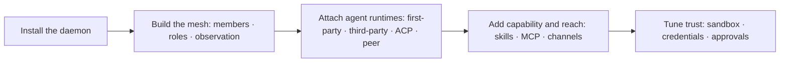

Start with [getting started](/getting-started)（简体中文：[开始使用 Monad](/zh-Hans/getting-started)）. These guides treat Monad as a daemon-first agent team runtime. Monad Mesh owns the team; agent runtimes — first-party or external — do the work under that authority.

Every guide shows the `monad` command first, because the CLI is the complete, scriptable
surface. Where the browser does the same job, the guide names the Studio screen next to
the command; the handful of things only the browser can do are listed in
[the web UI](/usage/web).

## Build the mesh

Monad Mesh is the agent team runtime. Read this first: it decides who is on the team and how their work is bound, observed, and approved.

| Doc | Covers |
|---|---|
| [from-one-agent-to-team.md](/guides/from-one-agent-to-team) | Growing from one supervised agent to a durable multi-agent project |
| [choosing-runtime.md](/guides/choosing-runtime) | Which agent runtime should execute a given piece of work |
| [mesh-agents.md](/usage/mesh-agents) | Running provider-native agent runtimes as team members and observing them |
| [native-cli-approvals.md](/usage/native-cli-approvals) | The per-agent autopilot switch for native CLI agents |

## Run the first-party agent

Monad Agent Runtime is Monad's own agent runtime and the default mesh member. These guides configure what it can call and know.

| Doc | Covers |
|---|---|
| [model-providers.md](/usage/model-providers) | Connect the models it calls |
| [skills.md](/usage/skills) | `SKILL.md` skills: using, writing, gating, forked execution, management |
| [mcp.md](/usage/mcp) | MCP servers: stdio and HTTP, secrets, OAuth, trust controls |
| [computer-use.md](/usage/computer-use) | Computer use and browser use via off-the-shelf MCP servers |

## Operate the daemon

| Doc | Covers |
|---|---|
| [installation.md](/usage/installation) | System requirements, release installer, manual installation, upgrades, and removal |
| [sessions.md](/usage/sessions) | Sessions and agents: create, branch, restore, watch across clients |
| [cli.md](/usage/cli) | Every command, global flags, aliases, exit codes, scripting patterns |
| [web.md](/usage/web) | The browser client: routes, Studio map, and what only it can do |
| [tui.md](/usage/tui) | Starting the terminal client and the keys it needs |
| [channels.md](/usage/channels) | IM channels: connections, group rules, and in-chat commands |
| [api.md](/usage/api) | The daemon API: transports, auth, realtime streams, error envelope, OpenAPI |

## Tune trust

| Doc | Covers |
|---|---|
| [sandbox-backends.md](/usage/sandbox-backends) | Choosing and configuring sandbox backends |
| [agent-runtime-credentials.md](/usage/agent-runtime-credentials) | Write-only credentials for generated code and shell processes |
| [privacy.md](/usage/privacy) | What is stored locally, and what leaves the machine |

## Maintain

| Doc | Covers |
|---|---|
| [troubleshooting.md](/usage/troubleshooting) | Symptom → cause → command, across every subsystem |
| [releases.md](/usage/releases) | Channels, upgrading, rollback, versioning and compatibility |

Read [Monad's architecture](/internals/index) to understand why the runtime behaves this way.
