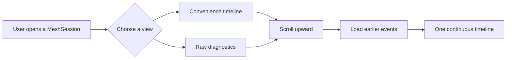
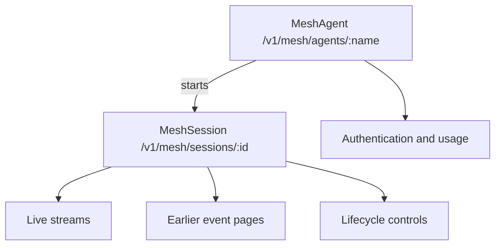
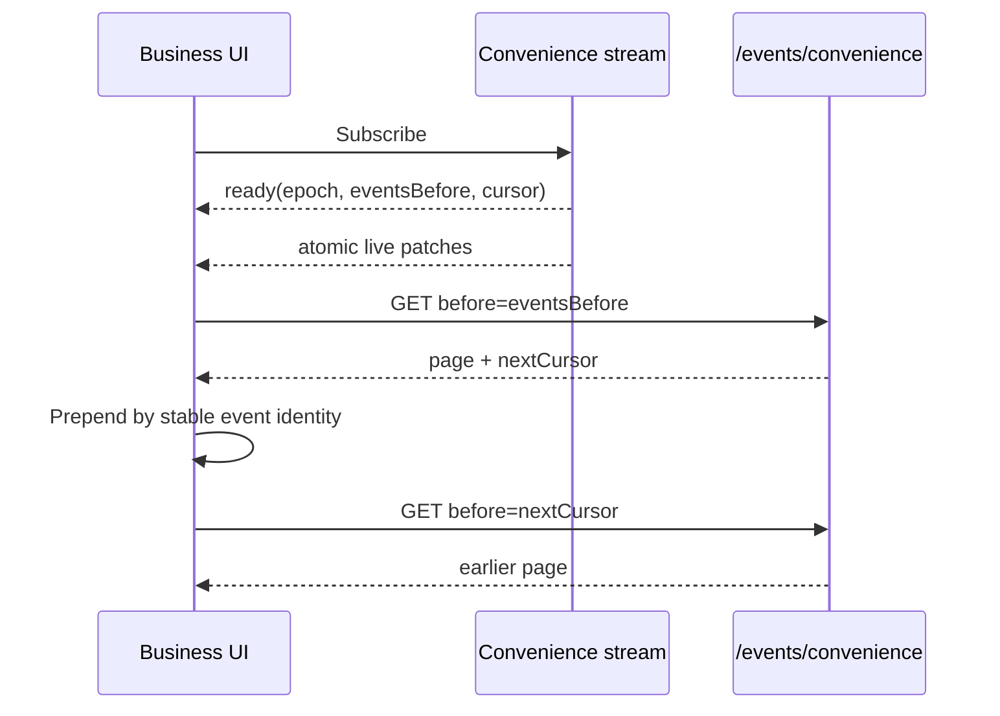
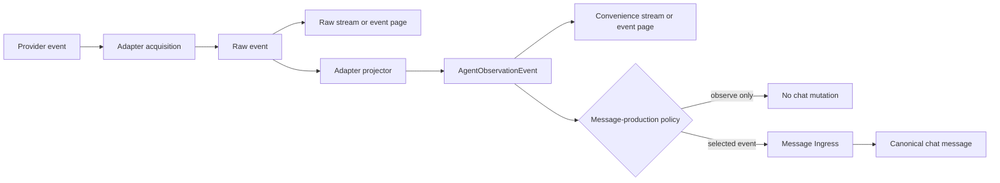
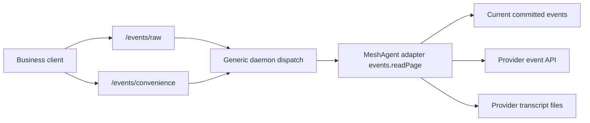

# Use MeshAgents and build adapters

MeshAgents bring provider-native coding agents into Monad without hiding their native
protocols, authentication, or session semantics. Monad supervises each runtime and
provides stable Mesh resources. An adapter owns everything provider-specific: launch,
control, event acquisition, cursors, and projection.

This guide starts with the user experience, documents the Hypertext Transfer Protocol
(HTTP) application programming interface (API), and then explains the adapter contract
for developers.

## Understand the Mesh model

Use these rules to orient yourself before working with a MeshAgent:

- A **MeshAgent** is a configured provider-native agent, such as Codex or Claude Code.
- A **MeshSession** is one running or stopped instance of a MeshAgent.
- Live activity is delivered through raw or convenience streams.
- Earlier activity is loaded through raw or convenience event pages.
- Event cursors are opaque. Callers pass them back without parsing them.
- Monad routes and supervises. The selected adapter implements provider behavior.
- Observation does not write chat. Only Message Ingress can create chat messages.

## What users experience

Choose a MeshAgent, model, working directory, and supported runtime options. Monad
starts a MeshSession and shows its activity as one continuous timeline.

The timeline can display two views:

| View | What it shows | Best for |
| --- | --- | --- |
| Convenience | Provider-neutral reasoning, messages, tool activity, and status | Normal observation and product UI |
| Raw | Exact provider frames and native event records | Diagnostics and adapter development |

Scrolling upward loads earlier events. The user interface (UI) does not expose whether
an event came from the current connection, a provider API, or a local provider
transcript.



The provider still owns model behavior, native authentication, provider session
identity, and provider-owned approvals. Monad supplies the common shell: workspace
membership, authorization, lifecycle controls, observation, and message routing.

## Mesh resources

The public resource model has two primary nouns:



`transcriptTargetId` scopes a MeshSession to its Monad conversation or workspace. It
is supplied in the create body and list query instead of being encoded into a parent
`/sessions/:id` path.

### Create and list MeshSessions

Create MeshSessions at the Mesh root and filter the collection by transcript target:

```text
POST /v1/mesh/sessions
GET  /v1/mesh/sessions?transcriptTargetId=:transcriptTargetId
GET  /v1/mesh/sessions/:id
```

Creation accepts the MeshAgent name, `transcriptTargetId`, working path, and optional
runtime settings. The collection query requires `transcriptTargetId`; reading a single
MeshSession still enforces the same resource authorization.

Daemon-wide operational views use cursor pagination:

```text
GET /v1/mesh/runtimes
GET /v1/mesh/session-summaries
```

### Observe live events

Subscribe to one view and read connection state from the same MeshSession resource:

```text
GET /v1/mesh/sessions/:id/connection
GET /v1/mesh/sessions/:id/stream/raw
GET /v1/mesh/sessions/:id/stream/convenience
```

The raw and convenience routes are separate product surfaces:

- `stream/raw` delivers exact accepted provider frames.
- `stream/convenience` delivers a `ready` handshake followed by atomic patches.
- `connection` returns the current connection state, observation epoch, event boundary,
  and monotonic revision.

Stream requests accept `transcriptTargetId` and an optional `after` cursor. On
Server-Sent Events (SSE) reconnects, `Last-Event-ID` wins over `?after=` because it
represents the most recently received event. The query belongs to the original
subscription URL.

### Load earlier events

Load raw or convenience events without selecting a provider storage mechanism:

```text
GET /v1/mesh/sessions/:id/events/raw
GET /v1/mesh/sessions/:id/events/convenience
```

Both endpoints support backward pagination:

```http
GET /v1/mesh/sessions/mesh_123456789012/events/convenience
    ?transcriptTargetId=ses_123456789012
    &before=opaque_cursor_here
    &limit=20
```

The first request may omit `before`. Each response may return `nextCursor`; pass that
value unchanged as the next request's `before`. A missing `nextCursor` means there are
no earlier events.



Business clients understand only four pagination facts:

1. events are ordered;
2. `before` moves toward earlier events;
3. cursors are opaque;
4. `nextCursor` continues the same query.

They do not parse cursor variants, select a provider storage mechanism, or project
provider records.

### Control a MeshSession

Send lifecycle commands to the MeshSession resource:

```text
POST /v1/mesh/sessions/:id/input
POST /v1/mesh/sessions/:id/steer
POST /v1/mesh/sessions/:id/interrupt
POST /v1/mesh/sessions/:id/approval
POST /v1/mesh/sessions/:id/resize
POST /v1/mesh/sessions/:id/stop
```

Controls are available only when the active adapter and launch mode support them.
The UI must use reported capabilities instead of inferring support from the provider
name.

### Configure, authenticate, and inspect MeshAgents

Configure MeshAgents through the same `/v1/mesh/agents` resource used for authentication
and capability inspection:

```text
GET    /v1/mesh/agents
GET    /v1/mesh/agents/presets
GET    /v1/mesh/agents/:name
PUT    /v1/mesh/agents/:name
POST   /v1/mesh/agents/:name/enable
POST   /v1/mesh/agents/:name/disable
DELETE /v1/mesh/agents/:name
```

Provider-owned authentication and usage checks extend that resource:

```text
POST /v1/mesh/agents/:name/auth/start
GET  /v1/mesh/agents/:name/auth/status
GET  /v1/mesh/agents/:name/usage

GET  /v1/mesh/auth-sessions/:id
GET  /v1/mesh/auth-sessions/:id/events
POST /v1/mesh/auth-sessions/:id/input
POST /v1/mesh/auth-sessions/:id/resize
POST /v1/mesh/auth-sessions/:id/heartbeat
POST /v1/mesh/auth-sessions/:id/stop

GET  /v1/mesh/runtimes
GET  /v1/mesh/session-summaries
```

Authentication sessions use a scoped `controlToken`. They do not use
`transcriptTargetId` because they exist before a MeshSession is created.

### Resolve a managed delivery

Resolve a managed delivery pointer to its MeshSession:

```text
GET /v1/mesh/deliveries/:id
```

The response identifies its MeshSession. Read connection state, streams, and earlier
events through that MeshSession's standard resources. There is no second observation
contract scoped to a delivery pointer.

## Raw and convenience are two views of one source

Every accepted provider event enters the raw plane before parsing, merging, or
deduplication. The adapter then projects the same source event into Monad's neutral
observation contract.



If projection fails, raw delivery remains available. Convenience may report a safe
diagnostic or omit the unsupported projection, but it must not rewrite or suppress the
raw provider event.

### Raw event contract

For live text transports, `data` is the exact string frame accepted from the provider.
For an event page, `data` is the exact native record returned by the adapter.

```ts
type MeshRawEvent = {
  meshSessionId: MeshSessionId;
  provider: MeshAgentProvider;
  observationEpoch?: string;
  origin: 'live' | 'events';
  cursor: ObservationCursor;
  providerIdentity?: string;
  stream?: 'stdout' | 'stderr' | 'pty' | 'app-server';
  data: unknown;
  observedAt?: string;
};
```

`cursor` is a delivery position. `providerIdentity` is the provider's stable identity
for an event. They have different jobs and must not be substituted for one another.

Here, `pty` means pseudoterminal (PTY). Raw endpoints are privileged diagnostic
surfaces. Provider events may contain prompts, tool arguments, file content,
environment details, or credentials.

### Convenience stream contract

A convenience patch is one atomic SSE delivery unit. One committed raw position may
produce several operations, so the cursor belongs to the whole patch rather than an
individual projected event.

```ts
type MeshConvenienceFrame =
  | {
      kind: 'ready';
      observationEpoch?: string;
      cursor?: ObservationCursor;
      eventsBefore?: ObservationCursor;
    }
  | {
      kind: 'patch';
      cursor: ObservationCursor;
      operations: Array<
        | { op: 'upsert'; event: AgentObservationEvent }
        | { op: 'remove'; eventId: string }
      >;
    }
  | { kind: 'unavailable'; reason: string };
```

Consumers merge operations by `event.id`. The patch cursor and the raw frame cursor at
the same committed position have the same value, so the two views can be aligned
without making projected identity serve as a position.

## How earlier and live events join

The current connection may expose an event before the provider makes that event
available through its settled event source. Monad retains bounded raw data for the
current observation epoch so refresh and SSE resume remain gap-free.

The wire codec accepts exactly two position forms:

```text
live:<observationEpoch>:<seq>
provider:<opaqueToken>
```

`live:` locates a committed row in the current observation epoch. `provider:` carries
an adapter-owned continuation token for earlier events. Business clients still treat
both forms as opaque and only return them to the route that supplied them.

The storage choice is not part of the business contract:



The daemon does not branch on Codex, Claude Code, Gemini, or another provider. It:

1. authorizes the `transcriptTargetId` and MeshSession;
2. validates the common request schema;
3. maps the raw or convenience route to a requested view;
4. invokes the selected MeshAgent adapter;
5. validates and returns the adapter's page.

The adapter decides how to read the requested position, whether a provider source has
`exact` or `settled` coverage, and how raw events become convenience events. A page may
cross an internal storage boundary, but its `nextCursor` remains one opaque continuation
for the caller.

## The adapter boundary

A MeshAgent adapter owns four provider-specific responsibilities:

1. **Definition:** discovery, settings, models, icons, and supported launch modes.
2. **Runtime control:** launch, input, approval, resize, interrupt, steer, and stop.
3. **Event acquisition:** live framing, earlier-event reads, provider identities,
   coverage, and cursor interpretation.
4. **Projection:** deterministic raw-to-convenience conversion with provenance.

The daemon owns generic infrastructure: authorization, process and socket supervision,
connection epochs, bounded queues, transport framing, and contract validation. It does
not own provider event semantics or provider-specific fallback rules.

### One adapter event-page capability

The two HTTP event routes select different views of one adapter capability:

```ts
type MeshEventPageRequest = {
  view: 'raw' | 'convenience';
  before?: ObservationCursor;
  limit: number;
};

type MeshEventPage =
  | {
      view: 'raw';
      records: MeshRawEventRecord[];
      coverage: 'exact' | 'settled';
      nextCursor?: ObservationCursor;
    }
  | {
      view: 'convenience';
      frames: MeshConvenienceFrame[];
      nextCursor?: ObservationCursor;
    };

interface MeshAgentEventSource {
  readPage(
    context: MeshAgentEventContext,
    request: MeshEventPageRequest
  ): Promise<MeshEventPage>;
  createLiveProjector(context: MeshAgentProjectionContext): MeshLiveProjector;
}
```

There is no separate daemon provider-event implementation. Adding or changing a
provider event source changes its adapter, not the Mesh host or business UI.

### App-server transport stays hidden

An app-server adapter receives a frame-oriented `send` and `close` interface. The host
decides whether bytes travel through child-process stdio, WebSocket, or a Unix socket.
The adapter owns authentication and protocol semantics without depending on daemon
transport code.

App-server adapters usually perform four extra tasks:

1. send the provider initialization handshake;
2. correlate responses with their original request kind;
3. translate server-initiated requests and notifications;
4. expose controls only when the protocol supports them.

Do not infer a response type from payload shape when a protocol supplies request IDs.
Record the request kind when sending and dispatch the response through that ledger.

## Build a MeshAgent adapter

Use this sequence when adding a provider:

1. Declare the provider ID, label, icon, discovery probe, settings, models, and modes.
2. Return an exact argv-based launch specification and truthful capabilities.
3. Implement only the controls supported by each effective launch mode.
4. Capture every accepted live provider event before projection.
5. Implement `events.readPage` for raw and convenience views.
6. Return provider identity, opaque continuation cursors, and honest coverage.
7. Project known records into exact `AgentObservationEvent` contracts with provenance.
8. Preserve meaningful unknown records as safe diagnostics.
9. Verify live and earlier events converge on stable event identities.

### Contract tests that matter

Use sanitized fixtures captured from real providers. Cover at least:

- byte-exact or value-exact raw preservation;
- forward progress for opaque backward-pagination cursors;
- `exact` and `settled` coverage;
- exact convenience events with non-empty raw provenance;
- whole-prefix and incremental-projector equivalence;
- stable event identity across live and earlier-event reads;
- unknown-record behavior;
- raw delivery when projection fails;
- stale-epoch recovery and SSE resume;
- atomic multi-operation patches;
- identical behavior over Transmission Control Protocol (TCP) loopback and Unix
  transport.

## Reliability and security rules

Apply these rules to every MeshAgent adapter and transport:

- Parse untrusted data with protocol schemas at every wire boundary.
- Treat provider events, prompts, tool arguments, and metadata as hostile.
- Never log raw event payloads wholesale.
- Require resource-scoped authorization for raw endpoints.
- Commit a raw live event before publishing raw or convenience delivery.
- Bound retained pages, projector state, and subscriber queues.
- Disconnect slow consumers instead of retaining session-length state.
- Keep raw delivery independent from projection success.
- Do not fall back to chat messages when provider events are unavailable.
- Publish chat messages only through Message Ingress.

## Direct migration

Mesh naming replaces the former ExternalAgent API and types in one cutover. There are
no aliases, redirects, dual schemas, or compatibility exports.

| Removed | Replacement |
| --- | --- |
| `/sessions/:id/external-agents/start` | `POST /v1/mesh/sessions` |
| `/sessions/:id/external-agent-sessions` | `GET /v1/mesh/sessions?transcriptTargetId=:id` |
| `/external-agent-sessions/:id` | `/v1/mesh/sessions/:id` |
| `/external-agent-sessions/:id/stream/*` | `/v1/mesh/sessions/:id/stream/*` |
| `/external-agent-sessions/:id/history/raw` | `/v1/mesh/sessions/:id/events/raw` |
| `/external-agent-sessions/:id/history/convenience` | `/v1/mesh/sessions/:id/events/convenience` |
| `/external-agents/:name/*` | `/v1/mesh/agents/:name/*` |
| `/external-agent-auth-sessions/:id/*` | `/v1/mesh/auth-sessions/:id/*` |
| `/native-agent-deliveries/:id` | `/v1/mesh/deliveries/:id` |
| `ExternalAgent*` | `MeshAgent*` or the narrower `MeshSession*` / `MeshEvent*` concept |
| `historyBefore` | `eventsBefore` |

The old snapshot observation endpoints and generic `history-page` endpoint are removed
instead of being forwarded:

```text
/external-agent-sessions/:id/observation
/external-agent-sessions/:id/ui-observation
/external-agent-sessions/:id/ui-observation-stream
/external-agent-sessions/:id/history-page
/native-agent-deliveries/:id/observation
```

## Contract map

Use this map to find the owner of each Mesh contract:

| Concern | Source of truth |
| --- | --- |
| MeshAgent, MeshSession, event, and cursor schemas | `@monad/protocol` |
| Adapter authoring interface | `@monad/sdk-atom` `MeshAgentAdapter` |
| Provider-specific implementations | `@monad/atoms` MeshAgent adapters |
| Process, socket, epoch, and queue lifecycle | Daemon Mesh host |
| HTTP and SSE transport | Daemon transport plus `@monad/client` |
| Experience rendering | Workspace Experience observation components |
| Durable chat mutation | Daemon Message Ingress |

Keep the dependency direction visible during review: adapters produce provider-aware
event contracts; the daemon supervises and routes them; experiences render them. UI
state must not flow back into adapters, and observation must not bypass Message Ingress
to mutate chat.
