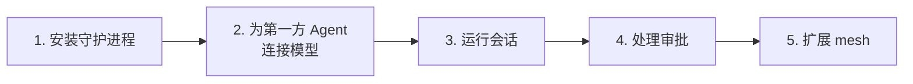
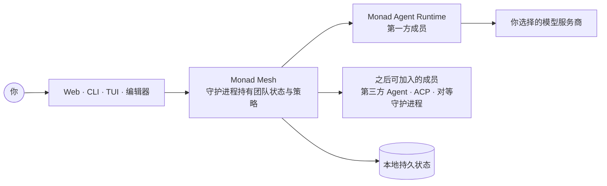
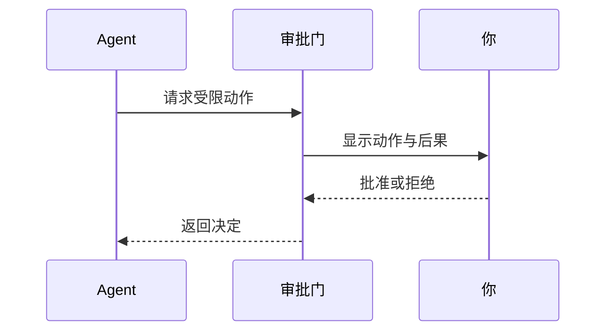

这篇教程用五步带你从安装走到可工作的 mesh。你要搭建的是一个 **Monad Mesh**：由守护进程持有的持久 Agent 团队。它从一个成员开始——**Monad Agent Runtime**，Monad 随附的第一方 Agent——之后可以加入其他 Agent 运行时，而不必迁移任何工作。

Monad 把自身状态保存在你的设备上，但发送给所选模型服务商的请求仍会离开设备。

English: [getting-started.md](/zh-Hans/getting-started)



## 1. 安装 Monad

使用[根 README](https://github.com/Monadix-AI/monad/blob/main/README.zh-CN.md#快速开始) 中的一种安装方式。
在交互式终端中，macOS、Linux 和 Windows 安装器都会自动启动守护进程并打开 Web UI；全新安装会进入
初始化流程。自动化或静默安装完成后运行 `monad up`，效果相同。



mesh 持有团队及其工作。关闭浏览器或终端不会把权威状态转移给其他客户端。

## 2. 连接模型

你的第一个 mesh 成员是 Monad Agent Runtime，它需要模型服务商。Monad 不内置本地推理引擎。如果你只打算使用 Codex、Claude Code 等第三方 Agent 服务商，它们各自单独认证，可以直接跳到第 5 步。

选择一种设置方式：

| 方式 | 命令或位置 |
|---|---|
| Web 引导 | 在全新安装上运行 `monad` |
| 终端引导 | 运行 `monad init` |
| Web 设置 | 打开 **Studio → Models and providers** |
| 脚本化设置 | 运行 `monad provider set` 与 `monad credential add` |

初始化流程会先测试连接，再保存配置并让你选择默认模型。各服务商的特殊配置见[模型服务商](/zh-Hans/usage/model-providers)。

检查设置结果：

```bash
monad model list
monad status
monad doctor
```

## 3. 运行第一个会话

会话是一条持久工作线程。它可以跨客户端关闭和守护进程重启存活，也可以从任意客户端操作。

运行一次性任务：

```bash
monad chat "总结这个目录里的改动"
```

创建并观察命名会话：

```bash
monad session new "我的第一个会话"
monad session send session_id_here "hello"
monad session watch session_id_here
monad session list
```

同一个会话会出现在 Web UI 中，因为状态位于守护进程。会话分支、恢复与脚本化操作见[会话](/zh-Hans/usage/sessions)和 [CLI 参考](/zh-Hans/usage/cli)。

## 4. 处理审批

当 Agent 请求受限动作时，当前轮次会停下等待决定。审批界面会说明请求的动作及其后果。



请记住这些规则：

- **拒绝是正常结果**：Agent 收到拒绝后可以继续工作
- **审批门 fail closed**：没有客户端可以回答时，高风险调用会被拒绝
- **沙箱是独立边界**：审批不能替代进程与网络隔离

扩大 Agent 自主权限前，请阅读[沙箱后端](/usage/sandbox-backends)。

## 5. 扩展 mesh

先加成员，再加能力。已有会话与历史保持不变。

| 目标 | 添加 | 指南 |
|---|---|---|
| 把服务商原生运行时作为队友 | 第三方 Agent（Codex、Claude Code、Gemini CLI……） | [第三方 Agent](/zh-Hans/usage/mesh-agents) |
| 把有边界的子任务交给其他 Agent | Agent Client Protocol 连接 | [ACP](/internals/agent-team-runtime/acp) |
| 使用你拥有的另一台机器 | 对等守护进程 | [对等联合](/internals/agent-team-runtime/peer-federation) |
| 让多个成员协作同一批工作 | 项目及其成员 | [组建团队](/guides/from-one-agent-to-team) |

随后再扩展单个成员的能力：

| 目标 | 添加 | 指南 |
|---|---|---|
| 添加可复用的操作知识 | Skill | [Skills](/zh-Hans/usage/skills) |
| 连接外部工具 | Model Context Protocol 服务 | [MCP](/zh-Hans/usage/mcp) |
| 从消息应用访问团队 | Channel | [消息渠道](/zh-Hans/usage/channels) |
| 安装厂商能力包 | Atom Pack | [Atoms](/internals/infra/atoms) |

在聊天输入框中输入 `/` 可以查看当前可用的 Skills 与命令。

## 下一步

- [Monad 是什么](/zh-Hans/product)解释产品边界
- [产品概念](/zh-Hans/concepts)定义共享术语
- [使用指南](/usage/index)介绍具体操作
- [隐私](/zh-Hans/usage/privacy)解释本地数据与网络出口
- [故障排查](/zh-Hans/usage/troubleshooting)按现象提供检查与修复方式
