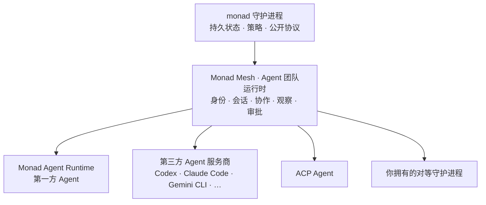

Agent 的身份、记忆、权限和历史，通常属于恰好在运行它的那个产品：产品一关，工作就没了；换一家厂商，团队就得重来。

**Monad 就是 Agent 生活的地方。** Monad 是 Monadix 推出的开源 Agent 团队运行时，采用无头架构、以守护进程为核心，以 MIT 许可证发布，安装为一个二进制。一个长期运行的本地守护进程自己持有团队的身份、能力、权限、记忆、会话、协作状态、审批与审计记录，并在客户端关闭、进程重启、成员底层运行时更换之后依然保留。客户端只负责呈现与控制，谁都不拥有这份状态。

**Monad Mesh** 就建立在这份所有权之上。它为每个 Agent 提供持久身份，把 Agent 绑定到会话与项目，并协调委派、观察、审批与恢复。来自不同运行时的 Agent 可以加入同一个 mesh：Codex、Claude Code 等第三方 Agent 服务商运行时、Agent Client Protocol（ACP）Agent、你自己拥有的对等守护进程，以及 **Monad Agent Runtime**。后者是 Monad 随附的第一方 Agent 运行时和默认成员，不是产品边界。

它安装为一个二进制、运行为一个进程，就在你日常使用的机器上，不需要集群、消息服务器、网关或对象存储。在 Monad Agent Runtime 上，每个 Agent 动作下面都有审批门、操作系统级沙箱、出口过滤与审计。由第三方运行时承载的成员沿用该运行时自己的执行与权限模型，Monad 记录它的活动，并在服务商暴露审批的前提下代理它的审批提示。

文档将产品操作与开发实现明确分开。

| 读者 | 从这里开始 | 目标 |
|---|---|---|
| **用户与运行时管理员** | [快速上手](/zh-Hans/getting-started) | 安装 Monad、组建 mesh、接入 Agent 运行时、配置能力与策略 |
| **开发者与贡献者** | [面向开发者的文档](#面向开发者的文档) | 使用公开协议开发、扩展 Monad 或修改仓库 |

English: [Documentation home](/index).

## 面向用户的文档

面向用户的页面解释 Monad 的产品行为，并帮助你完成具体操作。阅读这些页面不需要了解守护进程内部实现。

| 文档 | 用途 |
|---|---|
| [Monad 是什么](/zh-Hans/product) | 理解 daemon-first 产品边界与执行模型 |
| [产品概念](/zh-Hans/concepts) | 理解 Monad Mesh、Agent 运行时、会话、任务、产物、审批与客户端 |
| [快速上手](/zh-Hans/getting-started) | 安装 Monad、连接模型、运行会话、处理审批 |
| [安装与卸载](/zh-Hans/usage/installation) | 查看系统要求、手动安装、升级与卸载步骤 |
| [使用指南](/usage/index) | 按任务查找每项用户能力的操作文档 |
| [与其他 Agent 工具的对比](/zh-Hans/guides/alternatives) | 了解 Monad 与 Agent 框架、服务商原生 Agent、Agent 平台的区别 |
| [常见问题](/zh-Hans/guides/faq) | 快速了解范围、安全、支持的系统，以及哪些数据会离开本机 |

### 组建团队：Monad Mesh

Monad Mesh 是 Agent 团队运行时，也是首先要读的部分：它决定谁在团队里、每个成员能做什么，以及这些工作如何被绑定、观察和审批。

| 文档 | 用途 |
|---|---|
| [Mesh agents](/zh-Hans/usage/mesh-agents) | 把服务商原生 Agent 运行时作为可观察的队友运行 |
| [选择运行时](/guides/choosing-runtime) | 决定由哪个 Agent 运行时承载某个成员 |
| [组建团队](/guides/from-one-agent-to-team) | 从单个受监督 Agent 成长为持久的多 Agent 项目 |

### 运行第一方 Agent：Monad Agent Runtime

Monad Agent Runtime 是 Monad 自己的 Agent 运行时，也是 mesh 的默认成员。它是可挂载的能力，而不是产品边界。没有它，mesh 依然成立。

| 文档 | 用途 |
|---|---|
| [模型服务商](/zh-Hans/usage/model-providers) | 连接它所调用的模型 |
| [Skills](/zh-Hans/usage/skills) | 使用、编写、限制和管理 `SKILL.md` 能力 |
| [Model Context Protocol](/zh-Hans/usage/mcp) | 连接外部工具服务并配置信任边界 |
| [Computer use](/zh-Hans/usage/computer-use) | 通过 MCP 服务添加浏览器与桌面控制 |

### 运行守护进程

这些指南介绍持久守护进程和控制它的客户端：

| 文档 | 用途 |
|---|---|
| [会话](/zh-Hans/usage/sessions) | 跨客户端创建、分支、恢复和观察会话 |
| [CLI](/zh-Hans/usage/cli) | 运行命令、脚本和结构化输出工作流 |
| [守护进程 API](/usage/api) | 使用传输、认证、实时流、错误与仅限开发模式的本地 Scalar |
| [TUI](/zh-Hans/usage/tui) | 通过终端界面操作 Monad |
| [消息渠道](/zh-Hans/usage/channels) | 连接消息平台并配置访问策略 |
| [版本管理](/zh-Hans/usage/releases) | 选择发布通道、升级或回滚 |
| [故障排查](/zh-Hans/usage/troubleshooting) | 诊断守护进程、模型服务商、渠道、MCP 与沙箱问题 |
| [隐私](/zh-Hans/usage/privacy) | 了解本地存储与网络出口 |

### 调整信任边界

| 文档 | 用途 |
|---|---|
| [沙箱后端](/usage/sandbox-backends) | 为 Agent 动作选择隔离方式 |
| [Agent Runtime Credentials](/usage/agent-runtime-credentials) | 向生成的进程授予只写凭据 |
| [原生 CLI 审批](/usage/native-cli-approvals) | 配置原生 CLI Agent 的审批行为 |

## 面向开发者的文档

面向开发者的页面说明公开协议、已发布架构、扩展点、工程选择与产品设计基础。

| 分类 | 什么时候读 |
|---|---|
| [内部机制](/zh-Hans/internals/index) | 使用守护进程 API、协议、执行适配器或修改运行时行为 |
| [工程概览](/engineering/index) | 理解仓库架构、工程哲学或技术选型 |
| [产品设计](/design/index) | 理解产品原则与共享视觉系统 |

### 运行时内部机制

内部机制文档遵循 daemon-first 产品边界：

| 分类 | 内容 |
|---|---|
| [Monad Mesh](/internals/agent-team-runtime/index) | Agent 团队运行时：团队身份、项目会话、协作、委派、观察与联邦 |
| [Monad Agent Runtime](/internals/agent-runtime/index) | 第一方 Agent 运行时的工具循环、上下文、记忆与操作来源 |
| [基础设施](/internals/infra/index) | 守护进程生命周期、传输、配置、存储、扩展与模型路由 |
| [开发者参考](/internals/reference) | 服务、扩展类型、协作机制和客户端的共享术语 |

开发时应依赖公开 protocol 与 client 包，不要导入守护进程实现细节。优先使用 Skills、Atom packs、Model Context Protocol 服务、Hooks、Agent adapters 与 Workplace Experiences 等扩展面。

### 理解仓库

以下公开页面解释稳定设计决策，不规定仓库开发流程：

| 文档 | 内容 |
|---|---|
| [架构](/engineering/architecture) | 包边界与依赖方向 |
| [工程哲学](/engineering/philosophy) | 验证、显式协议与所有权原则 |
| [技术栈](/engineering/tech-stack) | 运行时、依赖库、构建工具与质量系统 |
| [产品原则](/design/product-principles) | 产品边界、受众、证据、品牌与无障碍 |
| [设计系统](/design/design-system) | 视觉 token、表面、字体、间距与动效 |

仓库规则与开发实践不会发布到 Mintlify。先阅读 [CONTRIBUTING.md](https://github.com/Monadix-AI/monad/blob/main/CONTRIBUTING.md)，再查阅[仅仓库可见的开发文档](https://github.com/Monadix-AI/monad/tree/main/docs/internal/development)。Coding Agent 协作说明单独放在[仅仓库可见的 Agent 文档](https://github.com/Monadix-AI/monad/tree/main/docs/internal/agents)。

只与单个包有关的文档保留在实现附近，例如 [Web 应用文档](https://github.com/Monadix-AI/monad/tree/main/apps/web/docs)、[沙箱加固状态](https://github.com/Monadix-AI/monad/blob/main/packages/sandbox/docs/hardening.md)与 [RTK client 文档](https://github.com/Monadix-AI/monad/blob/main/packages/client-rtk/README.md)。

Agent 指令不是产品文档。请修改 `.rulesync/rules/`，再运行 `bun run agents:sync`。不要直接修改生成的 `AGENTS.md` 或 `CLAUDE.md`。
