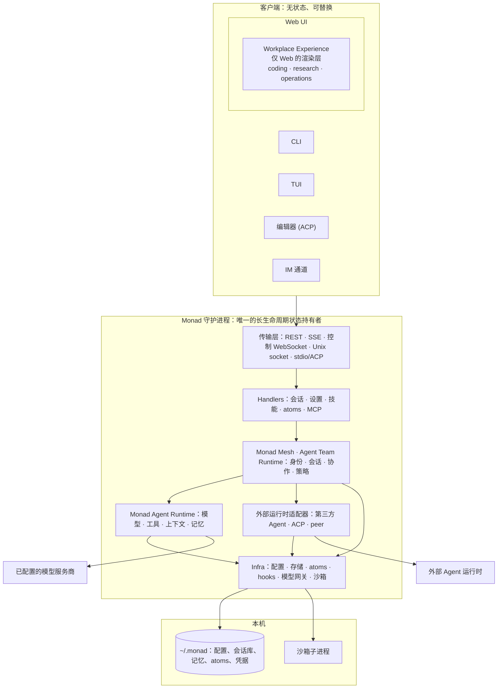
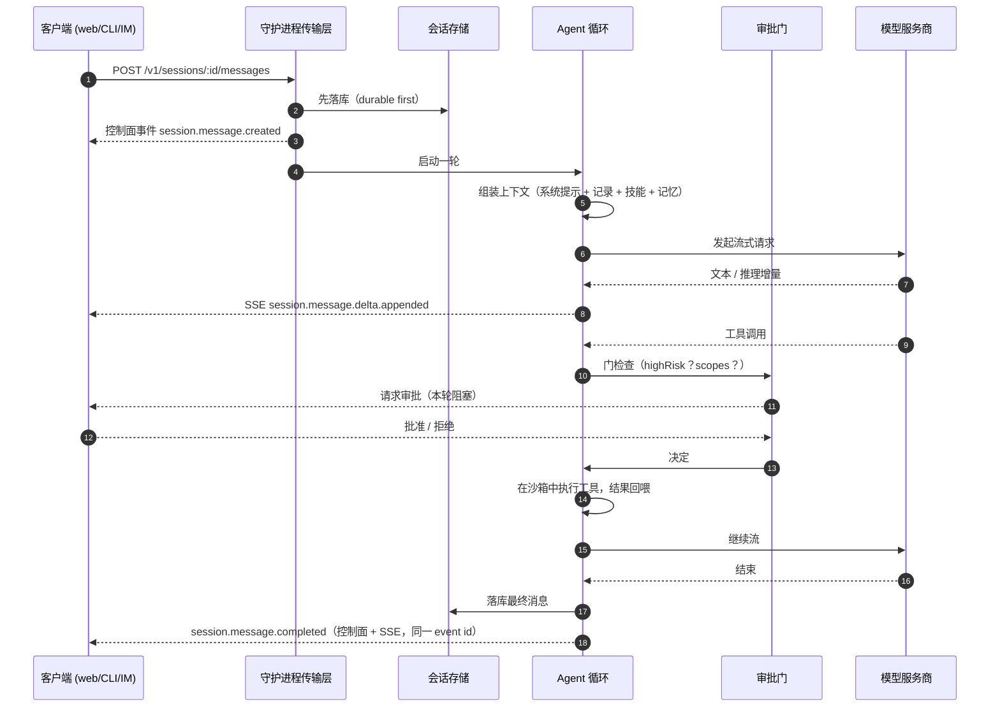
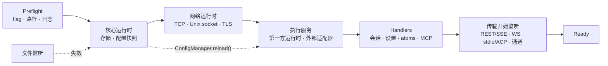
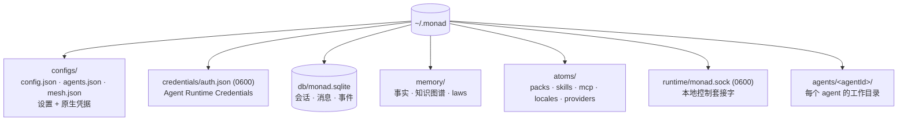
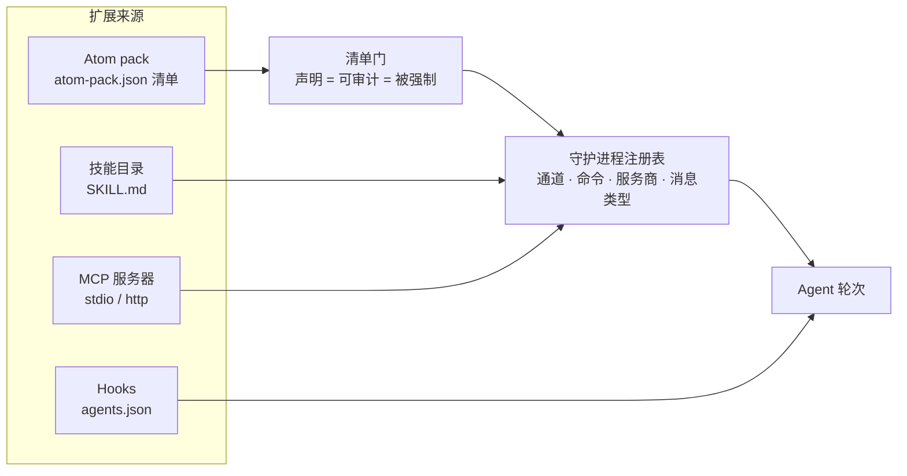
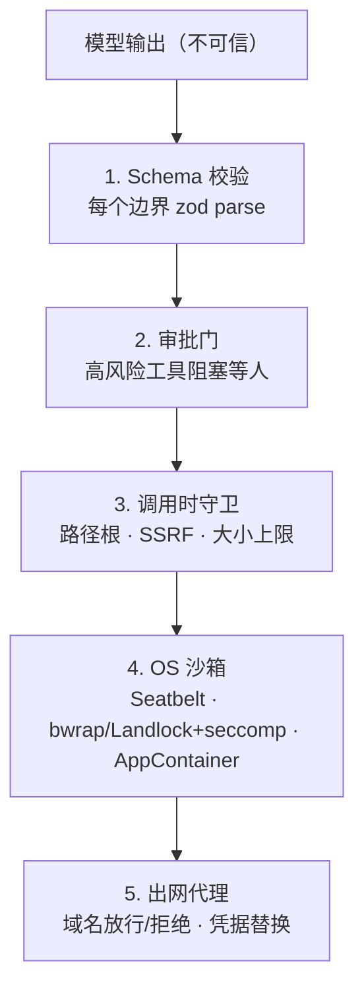

English: [Architecture overview](/zh-Hans/internals/index)

这是面向开发者的架构入口。Monad 守护进程持有 Agent 团队运行时，客户端与执行引擎通过公开协议接入。Monad Agent Runtime 是随附的第一方执行路径。

这一页回答三个问题：

1. **系统由哪些部分组成？** 查看下面的分层图
2. **随附 Agent 如何执行一轮？** 查看请求时序图
3. **接下来读什么？** 选择一个内部机制分类

| 分类 | 回答什么 | 什么时候读 |
|---|---|---|
| [`infra/`](/internals/infra/index) | 进程怎么启动、监听、存储、加载扩展 | 改传输、配置、存储、atoms、hooks、模型网关 |
| [`agent-team-runtime/`](/internals/agent-team-runtime/index) | Monad 如何把多个 Agent 与运行时组织成团队 | 改团队身份、协作、委派、联邦或 Experience |
| [`agent-runtime/`](/internals/agent-runtime/index) | 随附的第一方引擎如何执行一轮 | 改它的工具、上下文、记忆或执行语义 |

面向用户的功能文档在 [`../usage/`](/usage/index)；仓库工程规范在
[`../engineering/`](/engineering/index)。

## 1. 分层图

Monad 的所有设计都服从一条规则：**守护进程持有状态，客户端只负责渲染与操控。**

由此推出三条必须先内化的结论：

- **没有权威客户端。** 关掉浏览器不会中断一轮生成；CLI、Telegram 消息、编辑器可以驱动同一个会话。
- **Workplace Experience 是 Web UI 的功能，不是运行时的一层。** 它活在 `apps/web` 里，只负责
  重绘项目页面；CLI、TUI、编辑器和通道都不经过它。任何需要在所有客户端都可用的能力，必须放在
  守护进程侧（工具、命令、hooks、protocol），不能放进 experience。
- **跨进程边界的一切都要解析，不能信任**：HTTP、WebSocket、磁盘、MCP、atom pack、模型输出
  一视同仁。见[运行时安全模型](/internals/infra/runtime#security-model)。

## 2. 第一方 Agent 如何执行请求

这段时序描述随附的第一方执行引擎。外部运行时使用各自的适配器与观察协议。

这张图编码了三条不变量：

- **先落库，再发布。** 状态先提交存储，事件后发出。重连的客户端不会看到一个取不到状态的事件。
- **两条平面，永不合并。** 低频生命周期走控制 WebSocket，token 增量走 per-message SSE。细节见
  [`infra/realtime-channels.md`](/internals/infra/realtime-channels)。
- **审批门 fail-closed。** 高风险工具在没有可用审批门时被拒绝，而不是放行。细节见
  [`agent-runtime/tools.md`](/internals/agent-runtime/tools)。

## 3. 进程怎么起来

启动是一张按拓扑排序的生命周期图，不是一坨 `main()`。热重载刻意保守：尾部去抖、单飞、提交成功
才接受。完整模块表见 [`infra/daemon-architecture.md`](/internals/infra/daemon-architecture)。

## 4. 状态存在哪

路径布局由 `@monad/environment` 统一定义，包括 Linux 上的 XDG 拆分。详细边界见[运行时架构](/internals/infra/runtime)。

## 5. 怎么扩展

扩展遵循「先声明、后注册」：清单声明能力种类，宿主展示给用户审计，运行时强制执行。

内置**工具不是 atom kind**。它们随守护进程发布，安全防护保持第一方。见
[`infra/atoms.md`](/internals/infra/atoms)、[`../usage/skills.md`](/zh-Hans/usage/skills)、
[`infra/hooks.md`](/internals/infra/hooks)。

## 6. 约束层

每一层都假设上一层已经失效。完整威胁模型见[运行时安全模型](/internals/infra/runtime#security-model)，各平台落地现状见[沙箱后端](/usage/sandbox-backends)。

## 继续阅读

各分类的完整文档清单见英文版 [README.md](/internals/index#read-next)，或直接进入
[`infra/`](/internals/infra/index)、[`agent-team-runtime/`](/internals/agent-team-runtime/index)、
[`agent-runtime/`](/internals/agent-runtime/index)。
